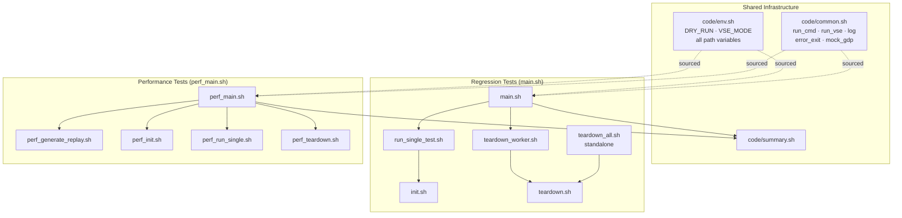

# CAT Framework — Improvements over Legacy

> Combined overview of all improvements across both entry points.
> Korean version: [IMPROVEMENTS_KR.md](IMPROVEMENTS_KR.md)

**Detailed breakdowns:**
- Regression tests (`main.sh`): [IMPROVEMENTS_MAIN.md](IMPROVEMENTS_MAIN.md)
- Performance tests (`perf_main.sh`): [IMPROVEMENTS_PERF.md](IMPROVEMENTS_PERF.md)

---

## High-Level Summary

| Area | Legacy | Current | Scope |
|---|---|---|---|
| Entry points | `init.sh`, `main.pl` (stubs) | `main.sh`, `perf_main.sh` | Both |
| Path resolution | Per-script `$(dirname $0)` | `script_dir` exported once | Both |
| Error handling | Silent failures | `set -euo pipefail` + explicit messages | Both |
| Dry-run support | None | 3-level `DRY_RUN` (0/1/2) | Both |
| VSE invocation | Hardcoded `vse_sub` + `bwait` | `run_vse()` — `vse_run`/`vse_sub` switchable | Both |
| Parallel execution | Sequential `for` loop | `xargs -P` parallel workers | Both |
| Log management | Scattered | Central `log/` with timestamps | Both |
| Teardown timing | Blocking, after all tests | Background queue worker | `main.sh` |
| Workflow model | Single-shot | Session-based init/run/teardown | `perf_main.sh` |
| Workspace types | MANAGED only | MANAGED + UNMANAGED (auto-setup) | `perf_main.sh` |
| Workspace lookup | Hardcoded relative paths | `gdp find` dynamic lookup | `perf_main.sh` |
| Race condition | Unhandled (silent corruption) | `flock` on `gdp build workspace` | `perf_main.sh` |
| GDP folder setup | Manual prerequisite | `ensure_gdp_folders()` auto-creates | `perf_main.sh` |
| Common libraries | Not supported | `-common LIB` appends to all combos | `perf_main.sh` |

---

## Architecture Overview



---

## Cross-Cutting Improvements

These improvements apply to **both** `main.sh` and `perf_main.sh`.

### 1. script_dir Propagation

```
BEFORE: each script runs $(dirname "$0") — breaks when called from another dir

AFTER:  entry point sets script_dir once and exports it:
          script_dir="$(cd "$(dirname "$0")" && pwd)"
          export script_dir

        all child scripts enforce:
          [[ -n "${script_dir:-}" ]] || { echo "ERROR..."; exit 1; }

        exception: teardown_all.sh can run standalone (self-resolves)
```

### 2. DRY_RUN System

```
Level 2 — Print only       (preview, CI)
Level 1 — Mock external    (local smoke test without GDP/p4/VSE)
Level 0 — Production run

Usage:
  ./main.sh       -d 2   ./perf_main.sh -d 2   # preview
  ./main.sh       -d 1   ./perf_main.sh -d 1   # mock
  ./main.sh       -d 0   ./perf_main.sh -d 0   # production
```

### 3. VSE Abstraction

```
BEFORE: vse_sub + bwait (hardcoded, unreliable)

AFTER:  VSE_MODE="run"  →  vse_run (synchronous)
        VSE_MODE="sub"  →  vse_sub + bjobs polling (10s interval)

Switch at runtime:
  VSE_MODE=sub ./main.sh        VSE_MODE=sub ./perf_main.sh
```

### 4. Centralised Environment (code/env.sh)

```
BEFORE: environment variables duplicated inline in every script

AFTER:  single source of truth:
          GDP paths, FROM_LIB, VSE_VERSION, ICM_ENV
          DRY_RUN default, VSE_MODE default
          PERF_LIBS, PERF_TESTS, PERF_PREFIX, PERF_GDP_BASE
```

---

## main.sh — Key Improvements

> Full details: [IMPROVEMENTS_MAIN.md](IMPROVEMENTS_MAIN.md)

| Improvement | What changed |
|---|---|
| **Parallel test execution** | Sequential `for` loop → `xargs -n1 -P<jobs>` |
| **Background teardown worker** | Blocking post-run teardown → async queue processed during test execution |
| **Unique test IDs** | No ID → `<num>_<timestamp>_<PID>` stored in `uniqueid.txt` per test |
| **Error propagation** | Silent failure → `set -euo pipefail`, fail-fast `error_exit` |

```
main.sh flow:

  generate_templates()
       ↓
  get_tests()  →  [1, 2, 3, … N]
       ↓
  create_regression_dir()
       ↓
  prepare_tests()   (move replay files to test dirs)
       ↓
  [start teardown_worker in background]
       ↓
  xargs -P run_single_test.sh    ←── parallel
    ├─ init.sh
    └─ run_vse()  →  enqueue teardown
       ↓
  summary.sh
       ↓
  [wait for teardown_worker to drain]
```

---

## perf_main.sh — Key Improvements

> Full details: [IMPROVEMENTS_PERF.md](IMPROVEMENTS_PERF.md)

| Improvement | What changed |
|---|---|
| **Session-based workflow** | All-or-nothing → init once, run many, teardown when ready |
| **MANAGED + UNMANAGED workspaces** | MANAGED only → both types auto-setup in Phase 2 |
| **Dynamic workspace lookup** | Hardcoded path → `gdp find --type=workspace` |
| **flock on gdp build workspace** | Parallel calls → race condition on p4 protect table → serialised with flock |
| **ensure_gdp_folders()** | Manual folder creation required → auto-checked and created on init |
| **-common option** | No shared library support → `-common LIB` appends to all combos |
| **Replay generation decoupled** | Inline with init → Phase 1, can run standalone |
| **Run-time filtering** | No filtering → `-lib`, `-test`, `-mode` filter session at run time |

```
perf_main.sh flow:

  Phase 1  generate_replays()          sequential
       ↓
  Phase 2  init_workspaces()           parallel (flock at build)
    ├─ gdp create project/library
    ├─ [flock] gdp build workspace  →  WORKSPACES_MANAGED/
    ├─ symlinks (cdsLibMgr.il, .cdsenv)
    ├─ setup UNMANAGED (cp cds.lib, mv oa/, patch tag)
    └─ gdp rebuild workspace (restore MANAGED oa/)
       ↓
  save_session()  →  perf_session.txt
       ↓  (may be days later)
  Phase 3  run_tests()                 parallel
    ├─ gdp find  →  MANAGED path
    ├─ derive UNMANAGED path
    └─ run_vse()  in workspace dir
       ↓
  summary.sh
       ↓  (optionally)
  Phase 5  teardown_workspaces()       parallel
    └─ gdp find → gdp delete → safe_rm_rf (MANAGED + UNMANAGED)
```

---

## Key File Changes

| File | Legacy | Current |
|---|---|---|
| `main.sh` | Missing (deleted) | Restored — structured Bash, `script_dir`, parallel xargs |
| `perf_main.sh` | `main.pl` (Perl 1-liner) | Full Bash rewrite — session-based, phased, rich options |
| `code/common.sh` | Not present | `run_cmd()`, `run_vse()`, `_mock_gdp_workspace()`, `safe_rm_rf()` |
| `code/env.sh` | Duplicated inline per script | Centralised — all variables in one place |
| `code/perf_init.sh` | `ICM_createProj.sh` (basic) | MANAGED + UNMANAGED, flock, symlinks, `-common` |
| `code/perf_teardown.sh` | `ICM_deleteProj.sh` | `gdp find` dynamic lookup, graceful not-found |
| `code/perf_run_single.sh` | Not present | Dynamic workspace lookup, `run_vse()` |
| `code/teardown_worker.sh` | Not present | Background teardown queue for regression tests |
| `.gitignore` | Minimal | Runtime outputs, logs, `GenerateReplayScript/`, `legacy/` excluded |
