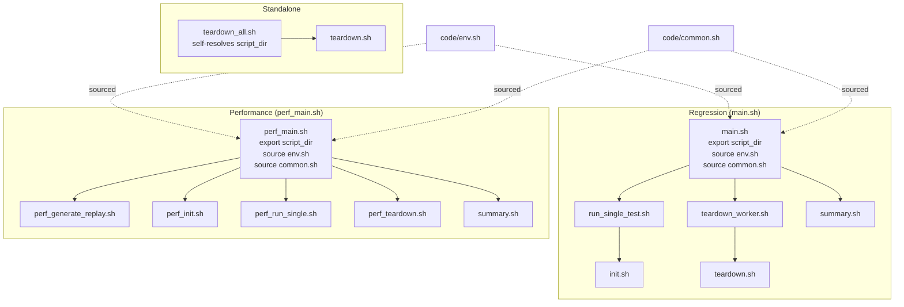
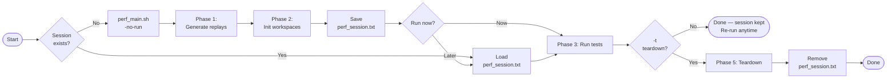
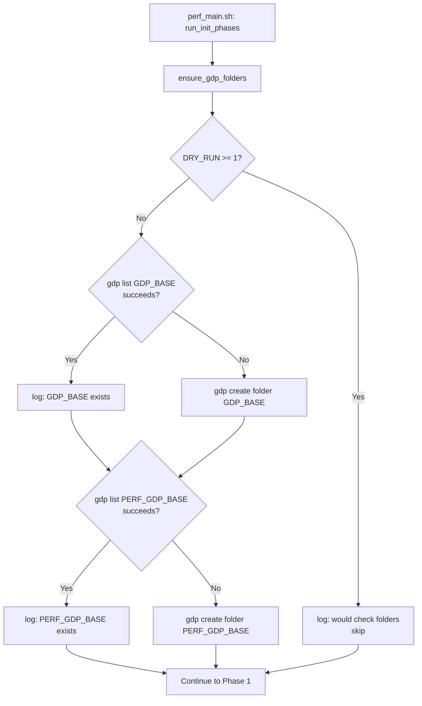

# CAT Framework — Improvements over Legacy

> A before-and-after comparison of the CAT automation framework redesign.
> Korean version: [IMPROVEMENTS_KR.md](IMPROVEMENTS_KR.md)

---

## Overview

| Area | Legacy (`1_cico` / `2_perf`) | Current |
|---|---|---|
| Entry points | `init.sh`, `main.pl` (stub scripts) | `main.sh`, `perf_main.sh` (structured Bash) |
| Dry-run support | None — every run hits real infra | 3-level `DRY_RUN` system |
| Parallel execution | Sequential `for` loop | `xargs -P` parallel workers |
| Path resolution | Each script resolves its own path | `script_dir` exported once from entry point |
| Workspace mock | None | GDP mock at `DRY_RUN=1` |
| VSE environment | Hardcoded `vse_sub` + `bwait` | `run_vse()` wrapper — `vse_run` / `vse_sub` switchable |
| Job completion wait | `bwait` (unreliable) | `bjobs` polling loop (10s interval) |
| Perf workflow | Single-shot, all-or-nothing | Session-based: init → run (×N) → teardown |
| Workspace lookup | Hardcoded relative paths | `gdp find` dynamic lookup |
| Race condition | Unhandled (silent corruption) | `flock` serialises `gdp build workspace` |
| GDP folder setup | Manual prerequisite | `ensure_gdp_folders()` auto-creates on init |
| Common libraries | Not supported | `-common LIB` appends to all test combos |
| Log management | Scattered per-script | Centralised `log/` directory with timestamps |
| Error handling | Silent failures, partial execution | Fail-fast `set -euo pipefail` + explicit messages |

---

## 1. Script Architecture

### Legacy — Isolated Scripts

Every script was standalone: each one re-resolved its own path, sourced its own
environment variables inline, and had no relationship to the others.
If a variable was needed in two scripts it was duplicated. There was no shared
logging, no shared error handling.

```
┌─────────────────────────────────────────────────────────────────┐
│  LEGACY                                                         │
│                                                                 │
│  main.pl ──── (Perl stub, 1 line)                               │
│                                                                 │
│  init.sh          teardown.sh         summary.sh                │
│    │                  │                   │                     │
│    └─ resolves        └─ resolves         └─ resolves           │
│       own path           own path            own path           │
│       sources own        sources own         sources own        │
│       env vars           env vars            env vars           │
│                                                                 │
│  ✗ No shared context                                            │
│  ✗ No common logging                                            │
│  ✗ No consistent error handling                                 │
└─────────────────────────────────────────────────────────────────┘
```

### Current — Entry Points Propagate Context



**Key rule:**
- `code/*.sh` child scripts **cannot** run standalone — they require `script_dir` to be
  exported by the parent entry point. If not set, they exit immediately with an error.
- `teardown_all.sh` is the single exception: it can self-resolve when invoked directly by
  the user (e.g. `./code/teardown_all.sh regression_test_001`).

```bash
# All code/*.sh scripts (except teardown_all.sh) enforce this at the top:
[[ -n "${script_dir:-}" ]] || {
    echo "ERROR: script_dir is not set. Run via main.sh or perf_main.sh." >&2
    exit 1
}
```

---

## 2. DRY_RUN System

### The Problem

Legacy scripts had no way to test or preview their behaviour without a fully
configured GDP / p4 / VSE environment. Every test run required real infrastructure.
This made script development and CI validation impossible without live access.

### The Solution — 3-Level DRY_RUN

```
┌──────────────────────────────────────────────────────────────────────┐
│                        DRY_RUN Levels                                │
├──────────┬───────────────────────────────────────────────────────────┤
│          │                                                           │
│  DRY_RUN │  Behaviour                                                │
│    = 2   │  ─────────────────────────────────────────────────────    │
│          │  PRINT ONLY — no commands are executed                    │
│          │  Every run_cmd() call logs "[DRY-RUN:2] Would: <cmd>"     │
│          │  Use for: previewing, CI syntax checks                    │
│          │                                                           │
├──────────┼───────────────────────────────────────────────────────────┤
│          │                                                           │
│  DRY_RUN │  MOCK MODE — skip external tools, simulate locally        │
│    = 1   │  ─────────────────────────────────────────────────────    │
│          │  Skipped: gdp  xlp4  rm  vse_run  vse_sub                 │
│          │  Mocked:  gdp build workspace                             │
│          │           → creates local directory structure:            │
│          │                                                           │
│          │  WORKSPACES_MANAGED/<ws_name>/                            │
│          │    cds.lib                                                │
│          │    cds.libicm                                             │
│          │    oa/<lib>/<cell>/                                       │
│          │    oa/<lib>/cdsinfo.tag  (DMTYPE p4)                      │
│          │                                                           │
│          │  Use for: local smoke test without real infrastructure     │
│          │                                                           │
├──────────┼───────────────────────────────────────────────────────────┤
│          │                                                           │
│  DRY_RUN │  PRODUCTION — all commands execute                        │
│    = 0   │  Use for: real test runs                                  │
│          │                                                           │
└──────────┴───────────────────────────────────────────────────────────┘
```

### How run_cmd() Works

```bash
run_cmd() {
    local cmd="$1"
    if [[ "${DRY_RUN}" -ge 2 ]]; then
        log "[DRY-RUN:2] Would: ${cmd}"      # print only
    elif [[ "${DRY_RUN}" -ge 1 ]] && [[ "${cmd}" =~ ^(gdp|xlp4|rm|vse_run|vse_sub) ]]; then
        log "[DRY-RUN:1] Skipping: ${cmd}"   # skip external tools
        _mock_gdp_workspace "${cmd}"         # mock if gdp build workspace
    else
        eval "${cmd}"                        # execute
    fi
}
```

### Usage

```bash
# Preview all commands without executing anything
./perf_main.sh -d 2 -lib BM01 -test checkHier

# Smoke test: runs full script logic, creates mock workspace dirs locally
./perf_main.sh -d 1 -no-run -lib BM01 -test checkHier

# Production run
./perf_main.sh -d 0 -lib BM01 -test checkHier
```

---

## 3. Parallel Execution

### Legacy — Sequential

```bash
# Legacy init (simplified)
for lib in ${libs}; do
    init.sh "$lib"     # one at a time
done
# With 4 libs: total time = t(BM01) + t(BM02) + t(BM03) + t(BM04)
```

### Current — Parallel with xargs -P

```
╔═══════════════════════════════════════════════════════════════════╗
║  main.sh — Regression Tests                                       ║
╠═══════════════════════════════════════════════════════════════════╣
║                                                                   ║
║  printf "%s\n" "${tests[@]}" | xargs -n1 -P4 bash run_single.sh  ║
║                                                                   ║
║  Time ──────────────────────────────────────────►                 ║
║         test_001 ████████████████████                             ║
║         test_002 ████████████                                     ║
║         test_003 ████████████████████████████                     ║
║         test_004 ████████                                         ║
║         test_005                   █████████████  (queued)        ║
║                                                                   ║
╚═══════════════════════════════════════════════════════════════════╝

╔═══════════════════════════════════════════════════════════════════╗
║  perf_main.sh — Performance Tests (3 phases)                      ║
╠═══════════════════════════════════════════════════════════════════╣
║                                                                   ║
║  Phase 1 — Generate Replays (SEQUENTIAL)                          ║
║    createReplay.pl must run one at a time (tool limitation)       ║
║    BM01 ────► BM02 ────► BM03 ────► BM04                         ║
║                                                                   ║
║  Phase 2 — Init Workspaces (PARALLEL, serialised at flock)        ║
║    xargs -n3 -P4                                                  ║
║    BM01: create project ████ build workspace* ██ setup UNMANAGED █║
║    BM02: create project ████ ····wait···· build workspace* ██ ···║
║    BM03: create project ████ ···············wait·············· ██ ║
║    (* flock serialises gdp build workspace — see section 7)       ║
║                                                                   ║
║  Phase 3 — Run Tests (PARALLEL)                                   ║
║    xargs -n4 -P4  (testtype lib mode ws_name)                     ║
║    checkHier/BM01/managed   ████████████████████                  ║
║    checkHier/BM01/unmanaged ████████████████████                  ║
║    checkHier/BM02/managed   ████████████████████                  ║
║    checkHier/BM02/unmanaged ████████████████████                  ║
║                                                                   ║
╚═══════════════════════════════════════════════════════════════════╝
```

### xargs Argument Mapping

| Phase | xargs | Arguments passed | Script receives |
|-------|-------|-----------------|----------------|
| Phase 2 Init | `-n3` | `testtype lib cell` | `$1 $2 $3` + `uniqueid` (extra) |
| Phase 3 Run | `-n4` | `testtype lib mode ws_name` | `$1 $2 $3 $4` + `uniqueid` (extra) |
| Phase 5 Teardown | `-n1` | `ws_name` | `$1` |

---

## 4. Perf Workflow — Session-Based

### Legacy — All or Nothing

```
main.pl
  └── init ALL workspaces
        └── run ALL tests
              └── teardown ALL workspaces
                  (cannot re-run, cannot partially run, no workspace reuse)
```

### Current — Decoupled Phases



### Session File Format

```
perf_session.txt
─────────────────────────────────────────────────────────────────
20260417_120000_username                        ← line 1: uniqueid
checkHier    BM01  perf_checkHier_BM01_20260417_120000_username
checkHier    BM02  perf_checkHier_BM02_20260417_120000_username
renameRefLib BM01  perf_renameRefLib_BM01_20260417_120000_username
─────────────────────────────────────────────────────────────────
  ^            ^    ^
  testtype     lib  ws_name (exact GDP workspace name)
```

The session stores the **actual workspace name** (not just a timestamp).
At run time, `perf_run_single.sh` uses `gdp find` to locate the workspace
directory regardless of when or where it was created.

### Workspace Lookup

| | Legacy | Current |
|---|---|---|
| MANAGED path | Hardcoded `../../workspaces/` | `gdp find --type=workspace ":=<ws_name>"` |
| UNMANAGED path | Not supported | Derived from MANAGED parent path substitution |
| Survives directory moves | ✗ | ✓ |
| Works across sessions | ✗ | ✓ |

---

## 5. Workspace Structure (MANAGED / UNMANAGED)

### Legacy

```
Single workspace type — no UNMANAGED concept.
Path was hardcoded. No automatic symlink setup.
```

### Current

```
WORKSPACES_MANAGED/<ws_name>/
│
├── cds.lib               ← library map (GDP-managed)
├── cds.libicm            ← ICManage library map
├── oa/
│   └── <lib>/
│       ├── <cell>/       ← design data (synced by gdp)
│       └── cdsinfo.tag   ← DMTYPE p4
├── cdsLibMgr.il ──symlink──► $CDS_LIB_MGR   (added after build)
├── .cdsenv      ──symlink──► code/.cdsenv    (added after build)
└── <testtype>_<lib>.au   ← replay script (copied from GenerateReplayScript/)


WORKSPACES_UNMANAGED/<ws_name>/
│
├── cds.lib               ← copied from MANAGED's cds.libicm (no cds.libicm here)
├── oa/
│   └── <lib>/
│       ├── <cell>/       ← moved from MANAGED (not re-synced by GDP)
│       └── cdsinfo.tag   ← DMTYPE none  ← patched (was p4)
└── <testtype>_<lib>.au   ← replay script (copied)
```

### UNMANAGED Setup Flow

```
perf_init.sh
  │
  ├─ 1. gdp build workspace  →  WORKSPACES_MANAGED/<ws>/oa/  (synced)
  │
  ├─ 2. Add symlinks to MANAGED workspace
  │       ln -sf $CDS_LIB_MGR  → cdsLibMgr.il
  │       ln -sf code/.cdsenv  → .cdsenv
  │
  ├─ 3. cp  cds.libicm  →  WORKSPACES_UNMANAGED/<ws>/cds.lib
  │
  ├─ 4. mv  MANAGED/oa  →  UNMANAGED/oa
  │
  ├─ 5. Patch cdsinfo.tag: DMTYPE p4 → DMTYPE none
  │
  └─ 6. gdp rebuild workspace  →  Restores MANAGED/oa from GDP
```

---

## 6. VSE Environment Abstraction

### Legacy

```bash
# Hardcoded — cannot switch without editing the script
vse_sub -v IC25.1... -env "$ICM_ENV" -replay "./replay.au" -log "out.log"
job_id=$(...)
bwait -w "ended($job_id)"    # bwait: unreliable, no timeout
```

### Current — run_vse() Wrapper

```
┌──────────────────────────────────────────────────────────────────┐
│                         run_vse()                                │
│  env.sh: VSE_MODE="${VSE_MODE:-run}"                             │
├────────────────────────┬─────────────────────────────────────────┤
│   VSE_MODE = "run"     │   VSE_MODE = "sub"                      │
│   (Environment 1)      │   (Environment 2)                       │
├────────────────────────┼─────────────────────────────────────────┤
│                        │                                         │
│  vse_run               │  vse_sub                                │
│    -v $VSE_VERSION      │    -v $VSE_VERSION                      │
│    -env $ICM_ENV        │    -env $ICM_ENV                        │
│    -replay $au          │    -replay $au                          │
│    -log $logfile        │    -log $logfile                        │
│                        │                                         │
│  Synchronous:          │  Asynchronous → job_id                  │
│  blocks until done     │                                         │
│                        │  Poll loop (10s interval):              │
│                        │  ┌─────────────────────────┐            │
│                        │  │  bjobs -noheader         │            │
│                        │  │    -o stat ${job_id}     │            │
│                        │  │                          │            │
│                        │  │  DONE  → exit loop ✓     │            │
│                        │  │  EXIT  → exit loop ✗     │            │
│                        │  │  other → sleep 10s       │            │
│                        │  └─────────────────────────┘            │
└────────────────────────┴─────────────────────────────────────────┘
```

### Switching Modes

```bash
# Option 1: permanent switch in code/env.sh
VSE_MODE="sub"

# Option 2: per-run override (no file edit needed)
VSE_MODE=sub ./perf_main.sh -lib BM01 -test checkHier
```

---

## 7. Race Condition Fix — p4 Protect Table

### The Problem

`gdp build workspace` writes to the Perforce protect table on the server.
When multiple `perf_init.sh` processes run in parallel and all call
`gdp build workspace` at the same time, the concurrent writes collide and
produce the error:

```
Cannot update the p4 protect table for <project>, see server logs for details
```

### The Solution — flock

`flock` is a Linux advisory lock. One process acquires the lock on a shared
file (`.gdp_ws_lock`); all others block until it is released.

```
perf_init.sh runs in parallel (xargs -P4):

  TIME ─────────────────────────────────────────────────────────►
                                                               
  BM01:  create project ████  flock:ACQUIRE ── build ── RELEASE
  BM02:  create project ████  flock:WAIT ──────────────────────── ACQUIRE ── build ── RELEASE
  BM03:  create project ████  flock:WAIT ──────────────────────────────────────────── ACQUIRE ── build
                                                               
  ┌──────────────────────────────────────────────────────────────┐
  │  GDP project/library creation: fully parallel ✓              │
  │  gdp build workspace: serialised via flock ✓                 │
  │  UNMANAGED setup (after build): fully parallel ✓             │
  └──────────────────────────────────────────────────────────────┘
```

```bash
# perf_init.sh — only the build step is inside the lock
(
    flock 9
    log "[INIT] Lock acquired for gdp build workspace: ${ws_name}"
    cd "${script_dir}/WORKSPACES_MANAGED" || exit 1
    run_cmd "gdp build workspace --content \"${config}\" ..."
) 9>"${script_dir}/.gdp_ws_lock"

# gdp rebuild workspace (MANAGED restore) does NOT write the protect table
# → runs outside the lock, in parallel
run_cmd "gdp rebuild workspace ."
```

---

## 8. GDP Folder Auto-Setup

### Legacy

```
GDP_BASE and PERF_GDP_BASE had to be created manually before any init.
A missing folder caused an opaque gdp error deep in the init sequence,
with no indication of what to create or where.
```

### Current — ensure_gdp_folders()



---

## 9. Common Libraries (`-common`)

### The Problem

Some libraries need to be present in every workspace regardless of test type —
for example, a reference library that all tests read from.
In the legacy framework there was no mechanism for this; you had to add the
library manually to every test init script.

### Current — `-common` Option

```bash
./perf_main.sh -no-run -lib BM01,BM02 -test checkHier,renameRefLib -common REF_LIB
```

```
perf_libs() expansion + -common append:

  checkHier / BM01     →  [ BM01                                 ] + [ REF_LIB ]
  checkHier / BM02     →  [ BM02                                 ] + [ REF_LIB ]
  renameRefLib / BM01  →  [ BM01  BM01_ORIGIN  BM01_TARGET       ] + [ REF_LIB ]
  renameRefLib / BM02  →  [ BM02  BM02_ORIGIN  BM02_TARGET       ] + [ REF_LIB ]
                          └────── per-testtype expansion ──────────┘   └─ appended ─┘
```

- `-common` accepts comma-separated values: `-common LIB_A,LIB_B`
- Each common lib is validated against `PERF_LIBS` at startup
- Implemented via `PERF_COMMON_LIBS` env var exported to child `perf_init.sh` processes

---

## 10. Key File Changes

| File | Legacy | Current |
|---|---|---|
| `main.sh` | Missing (deleted) | Restored — structured Bash, `script_dir`, parallel xargs |
| `perf_main.sh` | `main.pl` (Perl 1-liner) | Full Bash rewrite — session-based, phased, option-rich |
| `code/common.sh` | Not present | `run_cmd()`, `run_vse()`, `_mock_gdp_workspace()`, `safe_rm_rf()` |
| `code/env.sh` | Duplicated inline per script | Centralised — `DRY_RUN`, `VSE_MODE`, all path vars |
| `code/perf_init.sh` | `ICM_createProj.sh` (basic) | MANAGED + UNMANAGED setup, flock, symlinks, -common |
| `code/perf_teardown.sh` | `ICM_deleteProj.sh` | `gdp find` dynamic lookup, graceful not-found |
| `code/perf_run_single.sh` | Not present | Dynamic workspace lookup, `run_vse()`, CDS_log |
| `code/teardown_worker.sh` | Not present | Background teardown queue for regression tests |
| `.gitignore` | Minimal | Runtime outputs, logs, GenerateReplayScript/, legacy/ excluded |

---

## 11. Detailed Usage

### main.sh — Regression Tests

```
main.sh [options]

  -h  | --help                 Print this help
  -ws | --ws_name  <name>      Workspace prefix         (default: $WS_PREFIX)
  -proj| --proj_prefix <p>     Project prefix           (default: $PROJ_PREFIX)
  -cell| --cell    <name>      Cell name                (default: $CELLNAME)
  -m  | --max      <n>         Run tests 1~N            (default: $MAX_CASES)
  -c  | --cases    <list>      Specific tests: 1,3,5-9
  -j  | --jobs     <n>         Parallel jobs            (default: 4)
  -d  | --dry-run  [0|1|2]     Dry-run level            (default: $DRY_RUN)
  -t  | --teardown             Teardown after all tests
```

**Examples:**

```bash
# Preview all commands (no execution)
./main.sh -d 2

# Dry-run with local mock workspaces
./main.sh -m 10 -d 1

# Run tests 1-10 with 8 parallel jobs
./main.sh -m 10 -j 8 -d 0

# Run specific tests
./main.sh -c 1,3,5-9 -d 0

# Run with automatic teardown
./main.sh -m 10 -d 0 -t
```

---

### perf_main.sh — Performance Tests

```
perf_main.sh [options]

  -h           | --help             Print help
  -lib           <lib[,lib,...]>    Libraries to test    (default: all PERF_LIBS)
  -test          <test[,test,...]>  Test types to run    (default: all PERF_TESTS)
  -mode          <managed|unmanaged> Workspace mode      (default: both)
  -common        <lib[,lib,...]>    Libraries added to ALL combos
  -j           | --jobs <n>         Parallel jobs        (default: 4)
  -d           | --dry-run [0|1|2]  Dry-run level        (default: $DRY_RUN)
  -gen-replay  | --gen-replay       Phase 1 only: generate replay files
  -no-run      | --no-run           Init only: skip test execution
  -t           | --teardown         Teardown after tests (removes session file)
  -auto-init   | --auto-init        Auto-init if no session (skip prompt)
```

**Typical Workflow:**

```bash
# ── Step 1: Generate replay files only (optional, done by -no-run too) ──
./perf_main.sh -gen-replay -lib BM01 -test checkHier

# ── Step 2: Set up workspaces (done once) ──
./perf_main.sh -no-run -lib BM01,BM02 -test checkHier,renameRefLib

# ── Step 3: Run tests (repeat as needed with different filters) ──
./perf_main.sh                                     # run all session entries
./perf_main.sh -lib BM01                           # only BM01
./perf_main.sh -test checkHier                     # only checkHier
./perf_main.sh -lib BM01 -test checkHier           # BM01 × checkHier
./perf_main.sh -lib BM01 -mode managed             # BM01 × managed only
./perf_main.sh -mode unmanaged                     # all × unmanaged only

# ── Step 4: Tear down when done ──
./perf_main.sh -no-run -t

# ── One-shot: init → run → teardown ──
./perf_main.sh -auto-init -t -lib BM01 -test checkHier
```

**Option Combination Table:**

```
Command                                                 Tests run
──────────────────────────────────────────────────────  ─────────────────────────────────────
perf_main.sh                                            all session entries × managed+unmanaged
perf_main.sh -lib BM02 -test checkHier                  checkHier/BM02 × managed+unmanaged  (2)
perf_main.sh -lib BM02 -test checkHier -mode managed    checkHier/BM02/managed only         (1)
perf_main.sh -mode unmanaged                            all session entries × unmanaged only
```

**Dry-run preview (no infra needed):**

```bash
# Print all commands perf_main.sh would run — no GDP / VSE calls
./perf_main.sh -d 2 -no-run -lib BM01 -test checkHier

# Smoke test with local mock workspace directories
./perf_main.sh -d 1 -no-run -lib BM01 -test checkHier
./perf_main.sh -d 1 -lib BM01 -test checkHier
./perf_main.sh -d 1 -no-run -t
```

**Switching VSE mode at runtime:**

```bash
VSE_MODE=sub ./perf_main.sh -lib BM01 -test checkHier    # batch submit + bjobs poll
VSE_MODE=run ./perf_main.sh -lib BM01 -test checkHier    # synchronous
```
