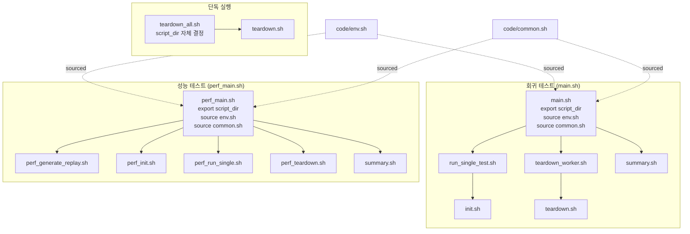
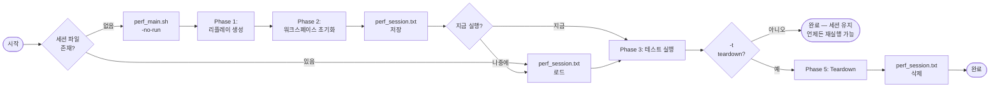
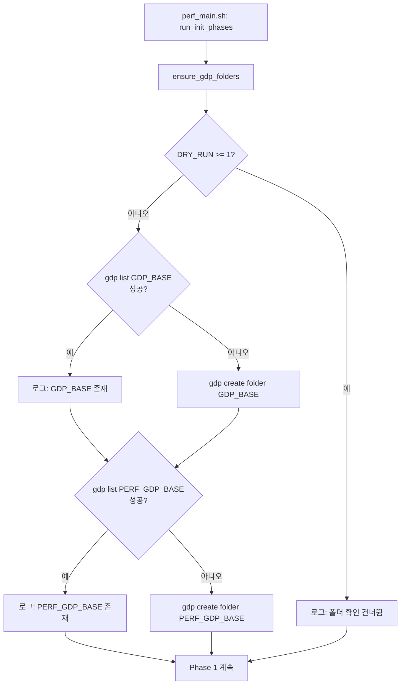

# CAT 프레임워크 — Legacy 대비 개선 내용

> CAT 자동화 프레임워크 재설계의 Before-and-After 비교 문서입니다.
> English version: [IMPROVEMENTS.md](IMPROVEMENTS.md)

---

## 개요

| 항목 | Legacy (`1_cico` / `2_perf`) | 현재 |
|---|---|---|
| 진입점 | `init.sh`, `main.pl` (스텁 스크립트) | `main.sh`, `perf_main.sh` (구조화된 Bash) |
| Dry-run 지원 | 없음 — 실행 시 항상 실제 인프라 호출 | 3단계 `DRY_RUN` 시스템 |
| 병렬 실행 | 순차 `for` 루프 | `xargs -P` 병렬 워커 |
| 경로 관리 | 각 스크립트가 개별로 경로 결정 | 진입점에서 `script_dir` 한 번만 export |
| 워크스페이스 목업 | 없음 | `DRY_RUN=1` 에서 GDP 목업 생성 |
| VSE 환경 | `vse_sub` + `bwait` 하드코딩 | `run_vse()` 래퍼 — `vse_run` / `vse_sub` 전환 가능 |
| 작업 완료 대기 | `bwait` (불안정) | `bjobs` 폴링 루프 (10초 간격) |
| Perf 워크플로우 | 단발성 실행, 모두 또는 없음 | 세션 기반: init → run(×N) → teardown 분리 |
| 워크스페이스 조회 | 하드코딩된 상대 경로 | `gdp find` 동적 조회 |
| 경쟁 조건 | 처리 없음 (조용한 오염) | `flock`으로 `gdp build workspace` 직렬화 |
| GDP 폴더 설정 | 수동 사전 작업 | `ensure_gdp_folders()` 초기화 시 자동 생성 |
| 공통 라이브러리 | 미지원 | `-common LIB` 으로 모든 테스트 콤보에 추가 |
| 로그 관리 | 스크립트마다 분산 | `log/` 디렉토리 중앙집중, 타임스탬프 포함 |
| 에러 처리 | 조용한 실패, 부분 실행 | `set -euo pipefail` + 명시적 오류 메시지 |

---

## 1. 스크립트 아키텍처

### Legacy — 독립된 스크립트들

모든 스크립트가 독립적으로 동작했습니다. 각 스크립트가 자신의 경로를 스스로 결정하고,
환경 변수를 인라인으로 각각 source했으며, 서로 간에 관계가 없었습니다.
공통 로깅, 공통 에러 처리가 없었고, 변수가 여러 스크립트에 필요하면 각각 중복 선언했습니다.

```
┌─────────────────────────────────────────────────────────────────┐
│  LEGACY                                                         │
│                                                                 │
│  main.pl ──── (Perl 스텁, 1줄)                                  │
│                                                                 │
│  init.sh          teardown.sh         summary.sh                │
│    │                  │                   │                     │
│    └─ 자신의 경로      └─ 자신의 경로      └─ 자신의 경로         │
│       자체 env source     자체 env source     자체 env source    │
│                                                                 │
│  ✗ 공유 컨텍스트 없음                                            │
│  ✗ 공통 로깅 없음                                                │
│  ✗ 일관된 에러 처리 없음                                          │
└─────────────────────────────────────────────────────────────────┘
```

### 현재 — 진입점에서 컨텍스트 전파



**핵심 규칙:**
- `code/*.sh` 자식 스크립트는 **단독으로 실행할 수 없습니다.** 부모 진입점이 `script_dir`을
  export하지 않으면 즉시 에러로 종료됩니다.
- `teardown_all.sh`만 유일한 예외: 사용자가 직접 호출할 수 있어 자체적으로 경로를 결정합니다.

```bash
# 모든 code/*.sh 스크립트(teardown_all.sh 제외) 상단에 포함:
[[ -n "${script_dir:-}" ]] || {
    echo "ERROR: script_dir is not set. Run via main.sh or perf_main.sh." >&2
    exit 1
}
```

---

## 2. DRY_RUN 시스템

### 문제

Legacy 스크립트는 실제 GDP / p4 / VSE 환경 없이는 동작이나 미리보기 자체가 불가능했습니다.
스크립트 자체의 로직 검증을 위해서도 전체 인프라 접근이 필요했습니다.

### 해결 — 3단계 DRY_RUN

```
┌──────────────────────────────────────────────────────────────────────┐
│                        DRY_RUN 레벨                                  │
├──────────┬───────────────────────────────────────────────────────────┤
│          │                                                           │
│  DRY_RUN │  동작                                                     │
│    = 2   │  ─────────────────────────────────────────────────────    │
│          │  출력만 — 어떤 명령도 실행되지 않음                         │
│          │  모든 run_cmd() 호출이 "[DRY-RUN:2] Would: <cmd>" 로그    │
│          │  용도: 미리보기, CI 문법 검사                               │
│          │                                                           │
├──────────┼───────────────────────────────────────────────────────────┤
│          │                                                           │
│  DRY_RUN │  목업 모드 — 외부 툴 건너뛰고 로컬 시뮬레이션              │
│    = 1   │  ─────────────────────────────────────────────────────    │
│          │  건너뜀: gdp  xlp4  rm  vse_run  vse_sub                  │
│          │  목업:   gdp build workspace                              │
│          │          → 로컬에 디렉토리 구조 생성:                      │
│          │                                                           │
│          │  WORKSPACES_MANAGED/<ws_name>/                            │
│          │    cds.lib                                                │
│          │    cds.libicm                                             │
│          │    oa/<lib>/<cell>/                                       │
│          │    oa/<lib>/cdsinfo.tag  (DMTYPE p4)                      │
│          │                                                           │
│          │  용도: 실제 인프라 없이 로컬 스모크 테스트                  │
│          │                                                           │
├──────────┼───────────────────────────────────────────────────────────┤
│          │                                                           │
│  DRY_RUN │  프로덕션 — 모든 명령 실행                                 │
│    = 0   │  용도: 실제 테스트 실행                                    │
│          │                                                           │
└──────────┴───────────────────────────────────────────────────────────┘
```

### run_cmd() 동작 원리

```bash
run_cmd() {
    local cmd="$1"
    if [[ "${DRY_RUN}" -ge 2 ]]; then
        log "[DRY-RUN:2] Would: ${cmd}"       # 출력만
    elif [[ "${DRY_RUN}" -ge 1 ]] && [[ "${cmd}" =~ ^(gdp|xlp4|rm|vse_run|vse_sub) ]]; then
        log "[DRY-RUN:1] Skipping: ${cmd}"    # 외부 툴 건너뜀
        _mock_gdp_workspace "${cmd}"          # gdp build workspace면 목업 생성
    else
        eval "${cmd}"                         # 실제 실행
    fi
}
```

### 사용법

```bash
# 어떤 명령이 실행될지 미리보기 (실제 실행 없음)
./perf_main.sh -d 2 -lib BM01 -test checkHier

# 스모크 테스트: 로컬 목업 워크스페이스 디렉토리 생성
./perf_main.sh -d 1 -no-run -lib BM01 -test checkHier

# 실제 프로덕션 실행
./perf_main.sh -d 0 -lib BM01 -test checkHier
```

---

## 3. 병렬 실행

### Legacy — 순차 실행

```bash
# Legacy init (단순화)
for lib in ${libs}; do
    init.sh "$lib"     # 한 번에 하나씩
done
# lib 4개면: 총 시간 = t(BM01) + t(BM02) + t(BM03) + t(BM04)
```

### 현재 — xargs -P 병렬 실행

```
╔═══════════════════════════════════════════════════════════════════╗
║  main.sh — 회귀 테스트                                            ║
╠═══════════════════════════════════════════════════════════════════╣
║                                                                   ║
║  printf "%s\n" "${tests[@]}" | xargs -n1 -P4 bash run_single.sh  ║
║                                                                   ║
║  시간 ──────────────────────────────────────────►                 ║
║         test_001 ████████████████████                             ║
║         test_002 ████████████                                     ║
║         test_003 ████████████████████████████                     ║
║         test_004 ████████                                         ║
║         test_005                   █████████████  (대기 중)       ║
║                                                                   ║
╚═══════════════════════════════════════════════════════════════════╝

╔═══════════════════════════════════════════════════════════════════╗
║  perf_main.sh — 성능 테스트 (3단계)                                ║
╠═══════════════════════════════════════════════════════════════════╣
║                                                                   ║
║  Phase 1 — 리플레이 생성 (순차)                                    ║
║    createReplay.pl 툴 제약으로 순차 실행 필요                       ║
║    BM01 ────► BM02 ────► BM03 ────► BM04                         ║
║                                                                   ║
║  Phase 2 — 워크스페이스 초기화 (병렬, flock에서 직렬화)             ║
║    xargs -n3 -P4                                                  ║
║    BM01: 프로젝트 생성 ████ build workspace* ██ UNMANAGED 설정 █   ║
║    BM02: 프로젝트 생성 ████ ···대기···· build workspace* ██ ···   ║
║    BM03: 프로젝트 생성 ████ ···············대기·············· ██  ║
║    (* flock으로 gdp build workspace 직렬화 — 7절 참조)            ║
║                                                                   ║
║  Phase 3 — 테스트 실행 (병렬)                                      ║
║    xargs -n4 -P4  (testtype lib mode ws_name)                     ║
║    checkHier/BM01/managed   ████████████████████                  ║
║    checkHier/BM01/unmanaged ████████████████████                  ║
║    checkHier/BM02/managed   ████████████████████                  ║
║    checkHier/BM02/unmanaged ████████████████████                  ║
║                                                                   ║
╚═══════════════════════════════════════════════════════════════════╝
```

### xargs 인수 매핑

| 단계 | xargs | 전달되는 인수 | 스크립트가 받는 값 |
|------|-------|-------------|-----------------|
| Phase 2 초기화 | `-n3` | `testtype lib cell` | `$1 $2 $3` + `uniqueid` (별도) |
| Phase 3 실행 | `-n4` | `testtype lib mode ws_name` | `$1 $2 $3 $4` + `uniqueid` (별도) |
| Phase 5 Teardown | `-n1` | `ws_name` | `$1` |

---

## 4. Perf 워크플로우 — 세션 기반

### Legacy — 단발성 실행

```
main.pl
  └── 전체 워크스페이스 초기화
        └── 전체 테스트 실행
              └── 전체 워크스페이스 삭제
                  (재실행 불가, 부분 실행 불가, 워크스페이스 재사용 불가)
```

### 현재 — 단계 분리



### 세션 파일 형식

```
perf_session.txt
─────────────────────────────────────────────────────────────────
20260417_120000_username                        ← 1행: uniqueid
checkHier    BM01  perf_checkHier_BM01_20260417_120000_username
checkHier    BM02  perf_checkHier_BM02_20260417_120000_username
renameRefLib BM01  perf_renameRefLib_BM01_20260417_120000_username
─────────────────────────────────────────────────────────────────
  ^            ^    ^
  testtype     lib  ws_name (실제 GDP 워크스페이스 이름)
```

세션 파일에는 **실제 워크스페이스 이름**이 저장됩니다 (타임스탬프만이 아닌).
실행 시 `perf_run_single.sh`가 `gdp find`로 워크스페이스 디렉토리를 동적으로 조회하므로
언제, 어디서 생성됐는지와 무관하게 올바른 경로를 찾습니다.

### 워크스페이스 조회 비교

| | Legacy | 현재 |
|---|---|---|
| MANAGED 경로 | 하드코딩된 `../../workspaces/` | `gdp find --type=workspace ":=<ws_name>"` |
| UNMANAGED 경로 | 미지원 | MANAGED 부모 경로 치환으로 파생 |
| 디렉토리 이동 후 동작 | ✗ | ✓ |
| 다른 세션에서 동작 | ✗ | ✓ |

---

## 5. 워크스페이스 구조 (MANAGED / UNMANAGED)

### Legacy

```
단일 워크스페이스 타입만 지원 — UNMANAGED 개념 없음.
경로 하드코딩. 심볼릭 링크 자동 설정 없음.
```

### 현재

```
WORKSPACES_MANAGED/<ws_name>/
│
├── cds.lib               ← 라이브러리 맵 (GDP 관리)
├── cds.libicm            ← ICManage 라이브러리 맵
├── oa/
│   └── <lib>/
│       ├── <cell>/       ← 설계 데이터 (gdp sync)
│       └── cdsinfo.tag   ← DMTYPE p4
├── cdsLibMgr.il ──심볼릭──► $CDS_LIB_MGR   (build 후 추가)
├── .cdsenv      ──심볼릭──► code/.cdsenv    (build 후 추가)
└── <testtype>_<lib>.au   ← 리플레이 스크립트 (GenerateReplayScript/에서 복사)


WORKSPACES_UNMANAGED/<ws_name>/
│
├── cds.lib               ← MANAGED의 cds.libicm 복사본 (cds.libicm 없음)
├── oa/
│   └── <lib>/
│       ├── <cell>/       ← MANAGED에서 이동 (GDP re-sync 없음)
│       └── cdsinfo.tag   ← DMTYPE none  ← 패치됨 (기존 p4)
└── <testtype>_<lib>.au   ← 리플레이 스크립트 (복사)
```

### UNMANAGED 설정 흐름

```
perf_init.sh
  │
  ├─ 1. gdp build workspace  →  WORKSPACES_MANAGED/<ws>/oa/ 생성 (sync)
  │
  ├─ 2. MANAGED 워크스페이스에 심볼릭 링크 추가
  │       ln -sf $CDS_LIB_MGR  → cdsLibMgr.il
  │       ln -sf code/.cdsenv  → .cdsenv
  │
  ├─ 3. cp  cds.libicm  →  WORKSPACES_UNMANAGED/<ws>/cds.lib
  │
  ├─ 4. mv  MANAGED/oa  →  UNMANAGED/oa
  │
  ├─ 5. cdsinfo.tag 패치: DMTYPE p4 → DMTYPE none
  │
  └─ 6. gdp rebuild workspace  →  MANAGED/oa 복원 (GDP sync)
```

---

## 6. VSE 환경 추상화

### Legacy

```bash
# 하드코딩 — 전환하려면 스크립트 직접 수정 필요
vse_sub -v IC25.1... -env "$ICM_ENV" -replay "./replay.au" -log "out.log"
job_id=$(...)
bwait -w "ended($job_id)"    # bwait: 불안정, 타임아웃 없음
```

### 현재 — run_vse() 래퍼

```
┌──────────────────────────────────────────────────────────────────┐
│                         run_vse()                                │
│  env.sh: VSE_MODE="${VSE_MODE:-run}"                             │
├────────────────────────┬─────────────────────────────────────────┤
│   VSE_MODE = "run"     │   VSE_MODE = "sub"                      │
│   (환경 1)              │   (환경 2)                              │
├────────────────────────┼─────────────────────────────────────────┤
│                        │                                         │
│  vse_run               │  vse_sub                                │
│    -v $VSE_VERSION      │    -v $VSE_VERSION                      │
│    -env $ICM_ENV        │    -env $ICM_ENV                        │
│    -replay $au          │    -replay $au                          │
│    -log $logfile        │    -log $logfile                        │
│                        │                                         │
│  동기 실행:             │  비동기 → job_id                        │
│  완료까지 블록          │                                         │
│                        │  폴링 루프 (10초 간격):                  │
│                        │  ┌─────────────────────────┐            │
│                        │  │  bjobs -noheader         │            │
│                        │  │    -o stat ${job_id}     │            │
│                        │  │                          │            │
│                        │  │  DONE  → 루프 종료 ✓     │            │
│                        │  │  EXIT  → 루프 종료 ✗     │            │
│                        │  │  기타  → sleep 10s       │            │
│                        │  └─────────────────────────┘            │
└────────────────────────┴─────────────────────────────────────────┘
```

### 모드 전환 방법

```bash
# 방법 1: code/env.sh에서 영구 변경
VSE_MODE="sub"

# 방법 2: 실행 시 오버라이드 (파일 수정 불필요)
VSE_MODE=sub ./perf_main.sh -lib BM01 -test checkHier
```

---

## 7. 경쟁 조건 수정 — p4 Protect Table

### 문제

`gdp build workspace`는 Perforce 서버의 protect table에 쓰기를 수행합니다.
여러 `perf_init.sh` 프로세스가 병렬로 실행되면서 동시에 `gdp build workspace`를
호출하면 동시 쓰기가 충돌하여 다음과 같은 오류가 발생합니다:

```
Cannot update the p4 protect table for <project>, see server logs for details
```

### 해결 — flock

`flock`은 Linux의 권고 잠금입니다. 한 프로세스가 공유 파일(`.gdp_ws_lock`)에 잠금을
획득하고, 나머지는 해제될 때까지 블록됩니다.

```
perf_init.sh 병렬 실행 (xargs -P4):

  시간 ─────────────────────────────────────────────────────────►

  BM01:  프로젝트 생성 ████  flock:획득 ── build ── 해제
  BM02:  프로젝트 생성 ████  flock:대기 ──────────────────────── 획득 ── build ── 해제
  BM03:  프로젝트 생성 ████  flock:대기 ──────────────────────────────────────── 획득 ── build

  ┌──────────────────────────────────────────────────────────────┐
  │  GDP 프로젝트/라이브러리 생성: 완전 병렬 ✓                    │
  │  gdp build workspace: flock으로 직렬화 ✓                     │
  │  UNMANAGED 설정 (build 후): 완전 병렬 ✓                      │
  └──────────────────────────────────────────────────────────────┘
```

```bash
# perf_init.sh — build 단계만 잠금 안에서 실행
(
    flock 9
    log "[INIT] Lock acquired for gdp build workspace: ${ws_name}"
    cd "${script_dir}/WORKSPACES_MANAGED" || exit 1
    run_cmd "gdp build workspace --content \"${config}\" ..."
) 9>"${script_dir}/.gdp_ws_lock"

# gdp rebuild workspace (MANAGED 복원)는 protect table 쓰기 없음
# → 잠금 밖에서 병렬 실행
run_cmd "gdp rebuild workspace ."
```

---

## 8. GDP 폴더 자동 설정

### Legacy

```
GDP_BASE와 PERF_GDP_BASE는 init 실행 전에 수동으로 생성해야 했습니다.
폴더가 없으면 init 시퀀스 깊은 곳에서 원인 불명의 gdp 오류가 발생했습니다.
무엇을, 어디에 만들어야 하는지 오류 메시지에서 알 수 없었습니다.
```

### 현재 — ensure_gdp_folders()



---

## 9. 공통 라이브러리 (`-common`)

### 문제

일부 라이브러리는 테스트 타입에 관계없이 모든 워크스페이스에 포함되어야 합니다.
예를 들어 모든 테스트가 읽는 참조 라이브러리 등입니다.
Legacy 프레임워크에는 이를 위한 메커니즘이 없었고, 각 init 스크립트에 수동으로 추가해야 했습니다.

### 현재 — `-common` 옵션

```bash
./perf_main.sh -no-run -lib BM01,BM02 -test checkHier,renameRefLib -common REF_LIB
```

```
perf_libs() 확장 + -common 추가:

  checkHier / BM01     →  [ BM01                                 ] + [ REF_LIB ]
  checkHier / BM02     →  [ BM02                                 ] + [ REF_LIB ]
  renameRefLib / BM01  →  [ BM01  BM01_ORIGIN  BM01_TARGET       ] + [ REF_LIB ]
  renameRefLib / BM02  →  [ BM02  BM02_ORIGIN  BM02_TARGET       ] + [ REF_LIB ]
                          └────── testtype별 확장 ─────────────────┘   └─ 추가 ─┘
```

- 쉼표 구분 복수 지정 가능: `-common LIB_A,LIB_B`
- 시작 시 `PERF_LIBS` 기준으로 유효성 검사 (`-lib`와 동일)
- `PERF_COMMON_LIBS` 환경 변수로 자식 `perf_init.sh` 프로세스에 전달

---

## 10. 주요 파일 변경 내역

| 파일 | Legacy | 현재 |
|---|---|---|
| `main.sh` | 누락 (삭제됨) | 복원 — 구조화된 Bash, `script_dir`, 병렬 xargs |
| `perf_main.sh` | `main.pl` (Perl 1줄) | 전체 Bash 재작성 — 세션 기반, 단계별, 풍부한 옵션 |
| `code/common.sh` | 없음 | `run_cmd()`, `run_vse()`, `_mock_gdp_workspace()`, `safe_rm_rf()` |
| `code/env.sh` | 각 스크립트마다 인라인 중복 | 중앙화 — `DRY_RUN`, `VSE_MODE`, 전체 경로 변수 |
| `code/perf_init.sh` | `ICM_createProj.sh` (기본) | MANAGED + UNMANAGED 설정, flock, 심볼릭 링크, -common |
| `code/perf_teardown.sh` | `ICM_deleteProj.sh` | `gdp find` 동적 조회, not-found 우아하게 처리 |
| `code/perf_run_single.sh` | 없음 | 동적 워크스페이스 조회, `run_vse()`, CDS_log |
| `code/teardown_worker.sh` | 없음 | 회귀 테스트용 백그라운드 teardown 큐 |
| `.gitignore` | 최소 | 런타임 출력, 로그, GenerateReplayScript/, legacy/ 제외 |

---

## 11. 상세 사용법

### main.sh — 회귀 테스트

```
main.sh [옵션]

  -h  | --help                 도움말 출력
  -ws | --ws_name  <name>      워크스페이스 접두사       (기본값: $WS_PREFIX)
  -proj| --proj_prefix <p>     프로젝트 접두사           (기본값: $PROJ_PREFIX)
  -cell| --cell    <name>      셀 이름                   (기본값: $CELLNAME)
  -m  | --max      <n>         테스트 1~N 실행           (기본값: $MAX_CASES)
  -c  | --cases    <list>      특정 테스트 지정: 1,3,5-9
  -j  | --jobs     <n>         병렬 잡 수                (기본값: 4)
  -d  | --dry-run  [0|1|2]     Dry-run 레벨              (기본값: $DRY_RUN)
  -t  | --teardown             테스트 완료 후 teardown
```

**사용 예:**

```bash
# 모든 명령 미리보기 (실행 없음)
./main.sh -d 2

# 로컬 목업 워크스페이스로 스모크 테스트
./main.sh -m 10 -d 1

# 8개 병렬 잡으로 테스트 1-10 실행
./main.sh -m 10 -j 8 -d 0

# 특정 테스트만 실행
./main.sh -c 1,3,5-9 -d 0

# 완료 후 자동 teardown
./main.sh -m 10 -d 0 -t
```

---

### perf_main.sh — 성능 테스트

```
perf_main.sh [옵션]

  -h           | --help             도움말 출력
  -lib           <lib[,lib,...]>    테스트할 라이브러리    (기본값: 전체 PERF_LIBS)
  -test          <test[,test,...]>  실행할 테스트 타입     (기본값: 전체 PERF_TESTS)
  -mode          <managed|unmanaged> 워크스페이스 모드     (기본값: 둘 다)
  -common        <lib[,lib,...]>    모든 콤보에 추가할 공통 라이브러리
  -j           | --jobs <n>         병렬 잡 수             (기본값: 4)
  -d           | --dry-run [0|1|2]  Dry-run 레벨           (기본값: $DRY_RUN)
  -gen-replay  | --gen-replay       Phase 1만: 리플레이 파일 생성
  -no-run      | --no-run           초기화만: 테스트 실행 건너뜀
  -t           | --teardown         테스트 후 teardown (세션 파일 삭제)
  -auto-init   | --auto-init        세션 없으면 자동 init (프롬프트 없음)
```

**일반적인 워크플로우:**

```bash
# ── Step 1: 리플레이 파일만 생성 (선택사항, -no-run 에도 포함됨) ──
./perf_main.sh -gen-replay -lib BM01 -test checkHier

# ── Step 2: 워크스페이스 설정 (한 번만) ──
./perf_main.sh -no-run -lib BM01,BM02 -test checkHier,renameRefLib

# ── Step 3: 테스트 실행 (필요에 따라 반복, 필터 변경 가능) ──
./perf_main.sh                                     # 전체 세션 엔트리 실행
./perf_main.sh -lib BM01                           # BM01만
./perf_main.sh -test checkHier                     # checkHier만
./perf_main.sh -lib BM01 -test checkHier           # BM01 × checkHier
./perf_main.sh -lib BM01 -mode managed             # BM01 × managed만
./perf_main.sh -mode unmanaged                     # 전체 × unmanaged만

# ── Step 4: 완료 후 teardown ──
./perf_main.sh -no-run -t

# ── 원샷: init → run → teardown ──
./perf_main.sh -auto-init -t -lib BM01 -test checkHier
```

**옵션 조합표:**

```
명령                                                    실행되는 테스트
──────────────────────────────────────────────────────  ─────────────────────────────────────
perf_main.sh                                            전체 세션 × managed+unmanaged
perf_main.sh -lib BM02 -test checkHier                  checkHier/BM02 × managed+unmanaged (2건)
perf_main.sh -lib BM02 -test checkHier -mode managed    checkHier/BM02/managed만           (1건)
perf_main.sh -mode unmanaged                            전체 세션 × unmanaged만
```

**Dry-run으로 미리보기 (인프라 불필요):**

```bash
# 실행될 모든 명령 출력 — GDP / VSE 호출 없음
./perf_main.sh -d 2 -no-run -lib BM01 -test checkHier

# 로컬 목업 워크스페이스 디렉토리로 스모크 테스트
./perf_main.sh -d 1 -no-run -lib BM01 -test checkHier
./perf_main.sh -d 1 -lib BM01 -test checkHier
./perf_main.sh -d 1 -no-run -t
```

**런타임 VSE 모드 전환:**

```bash
VSE_MODE=sub ./perf_main.sh -lib BM01 -test checkHier    # 배치 제출 + bjobs 폴링
VSE_MODE=run ./perf_main.sh -lib BM01 -test checkHier    # 동기 실행
```
