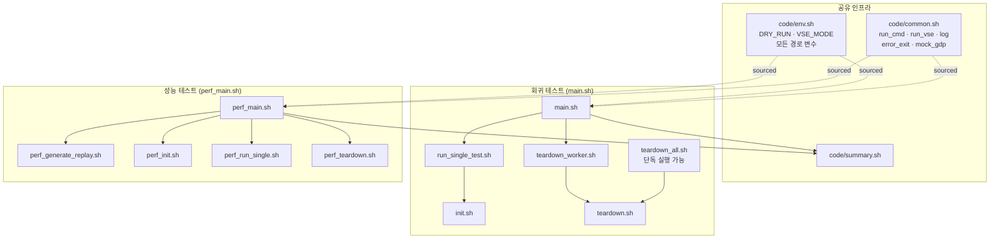

# CAT 프레임워크 — Legacy 대비 개선 내용 (통합)

> 두 진입점 전체의 개선 내용을 통합한 문서입니다.
> English version: [IMPROVEMENTS.md](IMPROVEMENTS.md)

**항목별 상세 문서:**
- 회귀 테스트 (`main.sh`): [IMPROVEMENTS_MAIN_KR.md](IMPROVEMENTS_MAIN_KR.md)
- 성능 테스트 (`perf_main.sh`): [IMPROVEMENTS_PERF_KR.md](IMPROVEMENTS_PERF_KR.md)

---

## 전체 요약

| 항목 | Legacy | 현재 | 적용 범위 |
|---|---|---|---|
| 진입점 | `legacy/1_cico/main.sh` (순차 Bash), `main.pl` (Perl + 템플릿) | `main.sh`, `perf_main.sh` | 공통 |
| 경로 관리 | 각 스크립트 `$(dirname $0)` | `script_dir` 한 번만 export | 공통 |
| 에러 처리 | 조용한 실패 | `set -euo pipefail` + 명시적 메시지 | 공통 |
| Dry-run 지원 | 없음 | 3단계 `DRY_RUN` (0/1/2) | 공통 |
| VSE 호출 | `vse_sub` + `bwait` 하드코딩 | `run_vse()` — `vse_run`/`vse_sub` 전환 | 공통 |
| 병렬 실행 | 순차 `for` 루프 | `xargs -P` 병렬 워커 | 공통 |
| 로그 관리 | 분산 | `log/` 중앙 집중, 타임스탬프 포함 | 공통 |
| Teardown 타이밍 | 블로킹, 전체 후 | 백그라운드 큐 워커 | `main.sh` |
| 워크플로우 모델 | 단발성 | 세션 기반 init/run/teardown 분리 | `perf_main.sh` |
| 워크스페이스 타입 | MANAGED만 | MANAGED + UNMANAGED (자동 설정) | `perf_main.sh` |
| 워크스페이스 조회 | 하드코딩 상대 경로 | `gdp find` 동적 조회 | `perf_main.sh` |
| 경쟁 조건 | 처리 없음 (조용한 손상) | `flock`으로 직렬화 | `perf_main.sh` |
| GDP 폴더 설정 | 수동 사전 작업 | `ensure_gdp_folders()` 자동 생성 | `perf_main.sh` |
| 공통 라이브러리 | 미지원 | `-common LIB` 으로 모든 콤보에 추가 | `perf_main.sh` |

---

## 전체 아키텍처



---

## 공통 개선 사항

두 진입점 모두에 적용되는 개선 내용입니다.

### 1. script_dir 전파

```
이전: 각 스크립트가 $(dirname "$0") 실행 — 다른 디렉토리에서 호출 시 깨짐

이후: 진입점이 script_dir을 한 번만 설정하고 export:
        script_dir="$(cd "$(dirname "$0")" && pwd)"
        export script_dir

      모든 자식 스크립트가 강제 확인:
        [[ -n "${script_dir:-}" ]] || { echo "ERROR..."; exit 1; }

      예외: teardown_all.sh는 단독 실행 가능 (자체 경로 결정)
```

### 2. DRY_RUN 시스템

```
레벨 2 — 출력만       (미리보기, CI)
레벨 1 — 외부 툴 목업  (GDP/p4/VSE 없이 로컬 스모크 테스트)
레벨 0 — 프로덕션 실행

사용법:
  ./main.sh       -d 2   ./perf_main.sh -d 2   # 미리보기
  ./main.sh       -d 1   ./perf_main.sh -d 1   # 목업
  ./main.sh       -d 0   ./perf_main.sh -d 0   # 프로덕션
```

### 3. VSE 추상화

```
이전: vse_sub + bwait (하드코딩, 불안정)

이후: VSE_MODE="run"  →  vse_run (동기 실행)
      VSE_MODE="sub"  →  vse_sub + bjobs 폴링 (10초 간격)

런타임 전환:
  VSE_MODE=sub ./main.sh        VSE_MODE=sub ./perf_main.sh
```

### 4. 중앙화된 환경 설정 (code/env.sh)

```
이전: 각 스크립트마다 환경 변수 인라인 중복

이후: 단일 소스:
        GDP 경로, FROM_LIB, VSE_VERSION, ICM_ENV
        DRY_RUN 기본값, VSE_MODE 기본값
        PERF_LIBS, PERF_TESTS, PERF_PREFIX, PERF_GDP_BASE
```

---

## main.sh — 주요 개선 내용

> 상세 내용: [IMPROVEMENTS_MAIN_KR.md](IMPROVEMENTS_MAIN_KR.md)

| 개선 항목 | 변경 내용 |
|---|---|
| **병렬 테스트 실행** | 순차 `for` 루프 → `xargs -n1 -P<jobs>` |
| **백그라운드 teardown 워커** | 블로킹 방식 → 테스트 실행 중 비동기 큐 처리 |
| **고유 테스트 ID** | 없음 → `<num>_<timestamp>_<PID>` 를 `uniqueid.txt`에 저장 |
| **에러 전파** | 조용한 실패 → `set -euo pipefail`, fail-fast `error_exit` |

```
main.sh 실행 흐름:

  generate_templates()
       ↓
  get_tests()  →  [1, 2, 3, … N]
       ↓
  create_regression_dir()
       ↓
  prepare_tests()   (리플레이 파일을 테스트 디렉토리로 이동)
       ↓
  [teardown_worker 백그라운드 시작]
       ↓
  xargs -P run_single_test.sh    ←── 병렬
    ├─ init.sh
    └─ run_vse()  →  teardown 큐에 추가
       ↓
  summary.sh
       ↓
  [teardown_worker 완료 대기]
```

---

## perf_main.sh — 주요 개선 내용

> 상세 내용: [IMPROVEMENTS_PERF_KR.md](IMPROVEMENTS_PERF_KR.md)

| 개선 항목 | 변경 내용 |
|---|---|
| **세션 기반 워크플로우** | 단발성 → init 한 번, 여러 번 run, 원하는 시점에 teardown |
| **MANAGED + UNMANAGED** | MANAGED만 → 두 타입 Phase 2에서 자동 설정 |
| **동적 워크스페이스 조회** | 하드코딩 → `gdp find --type=workspace` |
| **flock으로 경쟁 조건 해결** | 병렬 호출 → p4 protect table 경쟁 → flock으로 직렬화 |
| **ensure_gdp_folders()** | 수동 폴더 생성 필요 → init 시 자동 확인 및 생성 |
| **-common 옵션** | 공유 라이브러리 미지원 → `-common LIB` 으로 모든 콤보에 추가 |
| **리플레이 생성 분리** | init 내 인라인 → Phase 1, 단독 실행 가능 |
| **런타임 필터링** | 필터링 불가 → `-lib`, `-test`, `-mode` 로 세션 필터링 |

```
perf_main.sh 실행 흐름:

  Phase 1  generate_replays()          순차
       ↓
  Phase 2  init_workspaces()           병렬 (build 시 flock)
    ├─ gdp 프로젝트/라이브러리 생성
    ├─ [flock] gdp build workspace  →  WORKSPACES_MANAGED/
    ├─ 심볼릭 링크 (cdsLibMgr.il, .cdsenv)
    ├─ UNMANAGED 설정 (cds.lib 복사, oa/ 이동, tag 패치)
    └─ gdp rebuild workspace (MANAGED oa/ 복원)
       ↓
  save_session()  →  perf_session.txt
       ↓  (수일 후 가능)
  Phase 3  run_tests()                 병렬
    ├─ gdp find  →  MANAGED 경로
    ├─ UNMANAGED 경로 파생
    └─ run_vse()  워크스페이스 디렉토리 안에서 실행
       ↓
  summary.sh
       ↓  (선택적)
  Phase 5  teardown_workspaces()       병렬
    └─ gdp find → gdp delete → safe_rm_rf (MANAGED + UNMANAGED)
```

---

## 주요 파일 변경 내역

| 파일 | Legacy | 현재 |
|---|---|---|
| `main.sh` | 누락 (삭제됨) | 복원 — 구조화된 Bash, `script_dir`, 병렬 xargs |
| `perf_main.sh` | `main.pl` (Perl: 리플레이 생성 + 템플릿 치환 → 생성된 Bash 실행) | 전체 Bash 재작성 — 세션 기반, 단계별, 풍부한 옵션 |
| `code/common.sh` | 없음 | `run_cmd()`, `run_vse()`, `_mock_gdp_workspace()`, `safe_rm_rf()` |
| `code/env.sh` | 각 스크립트마다 인라인 중복 | 중앙화 — 모든 변수를 한 곳에 |
| `code/perf_init.sh` | `ICM_createProj.sh` (기본) | MANAGED + UNMANAGED, flock, 심볼릭 링크, `-common` |
| `code/perf_teardown.sh` | `ICM_deleteProj.sh` | `gdp find` 동적 조회, not-found 우아하게 처리 |
| `code/perf_run_single.sh` | 없음 | 동적 워크스페이스 조회, `run_vse()` |
| `code/teardown_worker.sh` | 없음 | 회귀 테스트용 백그라운드 teardown 큐 |
| `.gitignore` | 최소 | 런타임 출력, 로그, `GenerateReplayScript/`, `legacy/` 제외 |
