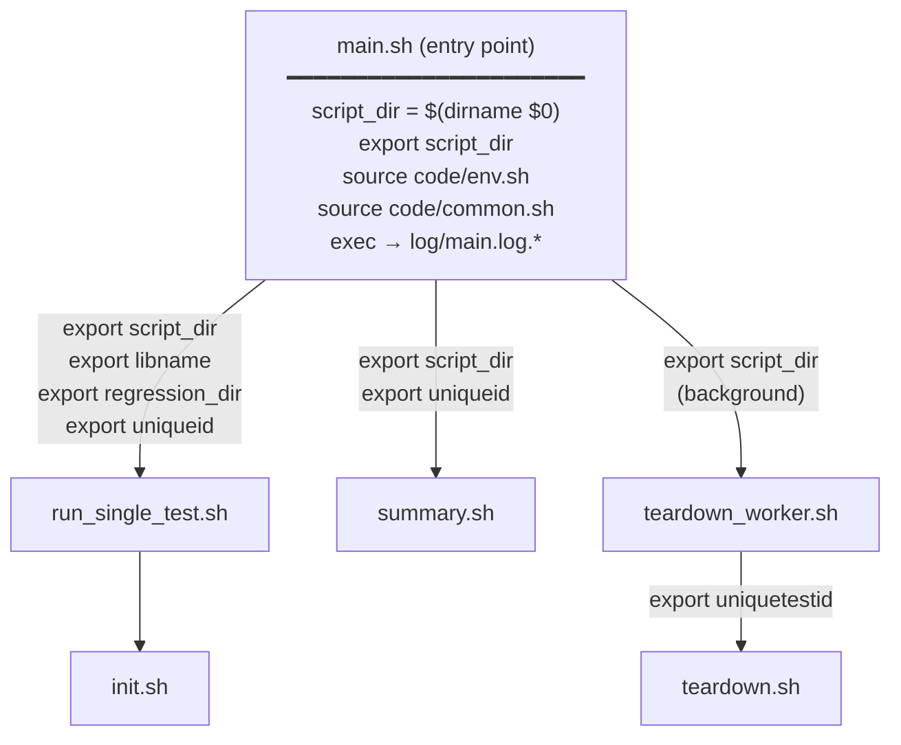
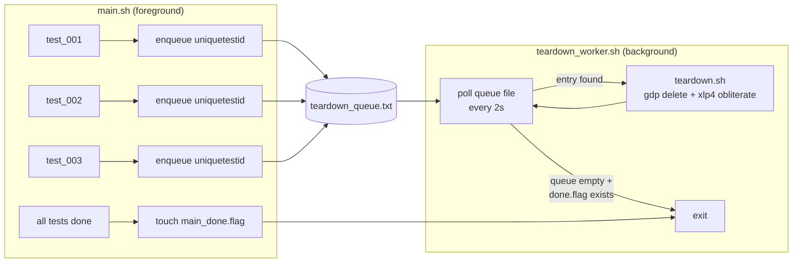

# CAT — Regression Test Framework (`main.sh`) Improvements

> Detailed before-and-after comparison for the regression test workflow.
> Korean version: [IMPROVEMENTS_MAIN_KR.md](IMPROVEMENTS_MAIN_KR.md)
> Combined overview: [IMPROVEMENTS.md](IMPROVEMENTS.md)

---

## Overview

| Area | Legacy | Current |
|---|---|---|
| Entry point | Missing / stub | `main.sh` — structured Bash |
| Path resolution | Per-script `$(dirname $0)` | `script_dir` exported once, inherited by all children |
| Error handling | Silent failures | `set -euo pipefail` + explicit `error_exit` messages |
| Dry-run support | None | 3-level `DRY_RUN` (0 = run / 1 = mock / 2 = print) |
| Test execution | Sequential `for` loop | `xargs -P` parallel workers |
| Job completion wait | `bwait` (unreliable) | `bjobs` polling loop (10 s interval) |
| Teardown timing | After all tests, blocking | Background worker — runs while tests continue |
| Log management | Scattered per-script | Central `log/perf_main.log.<timestamp>.txt` |
| VSE invocation | Hardcoded `vse_sub` | `run_vse()` wrapper — `vse_run` / `vse_sub` switchable |

---

## 1. Script Architecture

### Legacy

```
┌─────────────────────────────────────────────────────────────┐
│  LEGACY                                                     │
│                                                             │
│  main.pl  ←── (Perl stub, effectively 1 line)              │
│                                                             │
│  init.sh          teardown.sh          summary.sh           │
│    │                   │                    │               │
│    ├─ $(dirname $0)    ├─ $(dirname $0)     ├─ $(dirname $0)│
│    ├─ own env vars     ├─ own env vars      ├─ own env vars  │
│    └─ no shared log    └─ no shared log     └─ no shared log │
│                                                             │
│  Problems:                                                  │
│   ✗ No shared context between scripts                       │
│   ✗ No common error handling or logging                     │
│   ✗ Silent failures — partial execution with no warning     │
│   ✗ Cannot run from any directory other than project root   │
└─────────────────────────────────────────────────────────────┘
```

### Current



**Context propagation rule:**

```
main.sh                          (sets script_dir, sources env+common)
  │
  ├─ export script_dir ──────────────────────────────────────────┐
  │                                                              │
  ├─ run_single_test.sh          receives: script_dir            │
  │    └─ init.sh                receives: script_dir            │
  │                                                              │
  ├─ teardown_worker.sh          receives: script_dir            │
  │    └─ teardown.sh            receives: script_dir            │
  │                                                              │
  └─ summary.sh                  receives: script_dir            │
                                                                 │
  ALL child scripts enforce at top:                              │
    [[ -n "${script_dir:-}" ]] || { echo "ERROR..."; exit 1; }  │
```

---

## 2. DRY_RUN System

### The Problem

The legacy framework had no way to test or preview behaviour without a live
GDP / p4 / VSE environment. Every invocation attempted real infrastructure calls.

### Solution — 3-Level DRY_RUN

```
┌───────────┬──────────────────────────────────────────────────────────┐
│  DRY_RUN  │  Behaviour                                               │
├───────────┼──────────────────────────────────────────────────────────┤
│     2     │  PRINT ONLY                                              │
│           │  run_cmd() logs "[DRY-RUN:2] Would: <cmd>"               │
│           │  No commands executed at all                             │
│           │  Use for: previewing, CI syntax checks                   │
├───────────┼──────────────────────────────────────────────────────────┤
│     1     │  MOCK MODE                                               │
│           │  Skips: gdp  xlp4  rm  vse_run  vse_sub                 │
│           │  Mocks: gdp build workspace                              │
│           │    → creates local directory structure:                  │
│           │       cico_ws_<name>/                                    │
│           │         cds.lib, cds.libicm                              │
│           │         oa/<lib>/<cell>/                                 │
│           │         oa/<lib>/cdsinfo.tag  (DMTYPE p4)                │
│           │  Use for: smoke testing script logic locally             │
├───────────┼──────────────────────────────────────────────────────────┤
│     0     │  PRODUCTION — all commands execute normally              │
└───────────┴──────────────────────────────────────────────────────────┘
```

### How run_cmd() Works

```bash
# code/common.sh
run_cmd() {
    local cmd="$1"
    if   [[ "${DRY_RUN}" -ge 2 ]]; then
        log "[DRY-RUN:2] Would: ${cmd}"

    elif [[ "${DRY_RUN}" -ge 1 ]] && \
         [[ "${cmd}" =~ ^(gdp|xlp4|rm|vse_run|vse_sub) ]]; then
        log "[DRY-RUN:1] Skipping: ${cmd}"
        _mock_gdp_workspace "${cmd}"     # only if "gdp build workspace"

    else
        eval "${cmd}"
    fi
}
```

---

## 3. Parallel Test Execution

### Legacy — Sequential

```bash
for test in ${tests}; do
    run_single_test.sh "${test}"   # one at a time
done
# 10 tests × 5 min each = 50 min total
```

### Current — xargs -P parallel workers

```
printf "%s\n" "${tests[@]}" | xargs -n1 -P"${jobs}" bash run_single_test.sh

Time ─────────────────────────────────────────────────────►

  (legacy)   test_1 ──── test_2 ──── test_3 ──── test_4 ────

  (current, -j4)
             test_1 █████████████████
             test_2 █████████████
             test_3 █████████████████████
             test_4 ████████████████████
             test_5               █████████   ← starts when a slot frees

  10 tests × 5 min each / 4 workers ≈ 15 min  (vs 50 min sequential)
```

Each test gets a unique ID: `<test_num>_<timestamp>_<PID>` stored in
`regression_dir/test_<NNN>/uniqueid.txt` — used later by teardown.

---

## 4. Background Teardown Worker

### Legacy

Teardown ran synchronously after all tests completed, blocking the terminal.
No way to overlap teardown with test execution.

### Current — Asynchronous Queue



**Benefits:**
- Tests and teardown run **concurrently**: as soon as test_001 finishes, its
  workspace is being deleted while test_002–004 are still running.
- The worker is started in the background (`bash teardown_worker.sh &`) and
  `wait $!` is called only after all tests and the `main_done.flag` is set.
- If main.sh exits abnormally, the `_cleanup()` trap ensures the worker is
  waited on and the done flag is set.

---

## 5. VSE Environment Abstraction

### Legacy

```bash
vse_sub -v IC25.1... -env "${ICM_ENV}" -replay "./replay.au" -log "out.log"
job_id=$(echo "${vse_out}" | grep ...)
bwait -w "ended(${job_id})"    # bwait: unreliable, no timeout, not switchable
```

### Current — run_vse() in common.sh

```
┌──────────────────────────────────────────────────────────┐
│  run_vse <replay_file> <log_file>                        │
│  (VSE_MODE set in env.sh or overridden at runtime)       │
├──────────────────┬───────────────────────────────────────┤
│  VSE_MODE="run"  │  VSE_MODE="sub"                       │
│                  │                                       │
│  vse_run         │  vse_sub                              │
│   -v VERSION      │   -v VERSION                          │
│   -env ICM_ENV    │   -env ICM_ENV                        │
│   -replay $1      │   -replay $1                          │
│   -log $2         │   -log $2                             │
│                  │         ↓                             │
│  (synchronous)   │  job_id extracted from output         │
│  blocks until    │         ↓                             │
│  VSE exits       │  poll loop (every 10s):               │
│                  │    bjobs -noheader -o stat $job_id     │
│                  │    DONE → success exit                │
│                  │    EXIT → failure exit                │
│                  │    other → sleep 10                   │
└──────────────────┴───────────────────────────────────────┘
```

**Why bjobs polling instead of bwait:**
`bwait` was unreliable in this environment. The polling loop gives full
visibility into job state, makes timeout easy to add, and works identically
across LSF versions.

---

## 6. Detailed Usage

```
./main.sh [options]

  -h  | --help                 Print this help
  -ws | --ws_name  <name>      Workspace prefix           (default: $WS_PREFIX)
  -proj| --proj_prefix <p>     Project prefix             (default: $PROJ_PREFIX)
  -cell| --cell    <name>      Cell name                  (default: $CELLNAME)
  -m  | --max      <n>         Run tests 1~N              (default: $MAX_CASES)
  -c  | --cases    <list>      Specific tests: 1,3,5-9
  -j  | --jobs     <n>         Parallel job count         (default: 4)
  -d  | --dry-run  [0|1|2]     Dry-run level              (default: $DRY_RUN)
  -t  | --teardown             Teardown after all tests

  Note: -m and -c cannot be used together.
```

**Common workflows:**

```bash
# ── Preview: see all commands without executing ──────────────────
./main.sh -d 2

# ── Smoke test: full logic, mock workspaces, no real infra ───────
./main.sh -m 10 -d 1

# ── Run tests 1-10, 8 workers ────────────────────────────────────
./main.sh -m 10 -j 8 -d 0

# ── Run specific tests ────────────────────────────────────────────
./main.sh -c 1,3,5-9 -d 0

# ── Run with automatic teardown ──────────────────────────────────
./main.sh -m 10 -d 0 -t

# ── Override VSE mode for this run only ──────────────────────────
VSE_MODE=sub ./main.sh -m 5 -d 0
```

**Test lifecycle (per test):**

```
run_single_test.sh <test_id>
  │
  ├─ 1. init.sh
  │       gdp create project
  │       gdp create variant / libtype / config
  │       gdp create library (from $FROM_LIB)
  │       gdp build workspace
  │       ln -sf $CDS_LIB_MGR cdsLibMgr.il
  │
  ├─ 2. run_vse()
  │       VSE_MODE=run  → vse_run  (synchronous)
  │       VSE_MODE=sub  → vse_sub + bjobs poll
  │
  └─ 3. (if -t) enqueue uniquetestid → teardown_worker
```

**Teardown per test (teardown.sh):**

```
1. gdp find → locate workspace
2. gdp delete workspace
3. safe_rm_rf local workspace dir
4. xlp4 client -d -f  (delete p4 client)
5. gdp delete --recursive (project)
6. xlp4 obliterate (depot path)
```

---

## 7. Key Files

| File | Role |
|---|---|
| `main.sh` | Entry point — parses args, sets `script_dir`, orchestrates all phases |
| `code/env.sh` | All environment variables: paths, prefixes, `DRY_RUN`, `VSE_MODE` |
| `code/common.sh` | `run_cmd()`, `run_vse()`, `log()`, `error_exit()`, `_mock_gdp_workspace()` |
| `code/init.sh` | Create GDP project + workspace for one test |
| `code/run_single_test.sh` | Init + VSE run for one test; enqueues teardown if `-t` |
| `code/teardown.sh` | Delete GDP workspace + p4 client + project for one test |
| `code/teardown_all.sh` | Batch teardown for a whole regression directory (standalone) |
| `code/teardown_worker.sh` | Background queue worker — processes teardown entries as they arrive |
| `code/summary.sh` | Parse `result/<uniqueid>/*.log` → PASS/FAIL summary |
| `code/generate_templates.py` | Generate `replay_001.il` … `replay_N.il` from templates |
