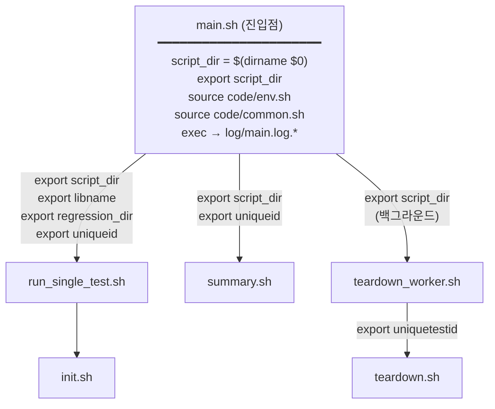
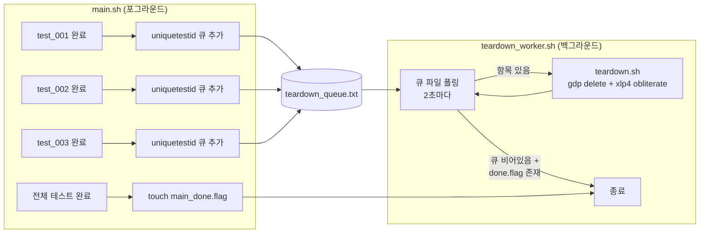

# CAT — 회귀 테스트 프레임워크 (`main.sh`) 개선 내용

> 회귀 테스트 워크플로우의 Before-and-After 비교 문서입니다.
> English version: [IMPROVEMENTS_MAIN.md](IMPROVEMENTS_MAIN.md)
> 통합 문서: [IMPROVEMENTS_KR.md](IMPROVEMENTS_KR.md)

---

## 개요

| 항목 | Legacy | 현재 |
|---|---|---|
| 진입점 | 누락 / 스텁 | `main.sh` — 구조화된 Bash |
| 경로 관리 | 각 스크립트가 `$(dirname $0)` 개별 처리 | `script_dir` 한 번만 export, 자식 스크립트 상속 |
| 에러 처리 | 조용한 실패 | `set -euo pipefail` + 명시적 `error_exit` 메시지 |
| Dry-run 지원 | 없음 | 3단계 `DRY_RUN` (0=실행 / 1=목업 / 2=출력만) |
| 테스트 실행 | 순차 `for` 루프 | `xargs -P` 병렬 워커 |
| 작업 완료 대기 | `bwait` (불안정) | `bjobs` 폴링 루프 (10초 간격) |
| Teardown 타이밍 | 전체 완료 후 블로킹 | 백그라운드 워커 — 테스트 진행 중에도 병행 |
| 로그 관리 | 스크립트마다 분산 | `log/main.log.<timestamp>.txt` 중앙 집중 |
| VSE 호출 | `vse_sub` 하드코딩 | `run_vse()` 래퍼 — `vse_run` / `vse_sub` 전환 가능 |

---

## 1. 스크립트 아키텍처

### Legacy

```
┌─────────────────────────────────────────────────────────────┐
│  LEGACY                                                     │
│                                                             │
│  main.pl  ←── (Perl 스텁, 사실상 1줄)                       │
│                                                             │
│  init.sh          teardown.sh          summary.sh           │
│    │                   │                    │               │
│    ├─ $(dirname $0)    ├─ $(dirname $0)     ├─ $(dirname $0)│
│    ├─ 자체 env 변수    ├─ 자체 env 변수     ├─ 자체 env 변수 │
│    └─ 공통 로그 없음   └─ 공통 로그 없음    └─ 공통 로그 없음│
│                                                             │
│  문제점:                                                    │
│   ✗ 스크립트 간 공유 컨텍스트 없음                           │
│   ✗ 공통 에러 처리 / 로깅 없음                               │
│   ✗ 조용한 실패 — 경고 없이 부분 실행                        │
│   ✗ 프로젝트 루트가 아닌 곳에서 실행 불가                    │
└─────────────────────────────────────────────────────────────┘
```

### 현재



**컨텍스트 전파 규칙:**

```
main.sh                          (script_dir 설정, env+common source)
  │
  ├─ export script_dir ──────────────────────────────────────────┐
  │                                                              │
  ├─ run_single_test.sh          script_dir 수신                 │
  │    └─ init.sh                script_dir 수신                 │
  │                                                              │
  ├─ teardown_worker.sh          script_dir 수신                 │
  │    └─ teardown.sh            script_dir 수신                 │
  │                                                              │
  └─ summary.sh                  script_dir 수신                 │
                                                                 │
  모든 자식 스크립트 상단에서 강제 확인:                          │
    [[ -n "${script_dir:-}" ]] || { echo "ERROR..."; exit 1; }  │
```

---

## 2. DRY_RUN 시스템

### 문제

Legacy는 실제 GDP / p4 / VSE 환경 없이는 동작 확인이나 미리보기가 불가능했습니다.
모든 실행이 실제 인프라 호출을 시도했습니다.

### 해결 — 3단계 DRY_RUN

```
┌───────────┬──────────────────────────────────────────────────────────┐
│  DRY_RUN  │  동작                                                    │
├───────────┼──────────────────────────────────────────────────────────┤
│     2     │  출력만                                                  │
│           │  run_cmd()가 "[DRY-RUN:2] Would: <cmd>" 로그             │
│           │  어떤 명령도 실행되지 않음                                │
│           │  용도: 미리보기, CI 문법 검사                             │
├───────────┼──────────────────────────────────────────────────────────┤
│     1     │  목업 모드                                               │
│           │  건너뜀: gdp  xlp4  rm  vse_run  vse_sub                │
│           │  목업: gdp build workspace                               │
│           │    → 로컬 디렉토리 구조 생성:                            │
│           │       cico_ws_<name>/                                    │
│           │         cds.lib, cds.libicm                              │
│           │         oa/<lib>/<cell>/                                 │
│           │         oa/<lib>/cdsinfo.tag  (DMTYPE p4)                │
│           │  용도: 실제 인프라 없이 스크립트 로직 스모크 테스트       │
├───────────┼──────────────────────────────────────────────────────────┤
│     0     │  프로덕션 — 모든 명령 정상 실행                          │
└───────────┴──────────────────────────────────────────────────────────┘
```

### run_cmd() 동작 원리

```bash
# code/common.sh
run_cmd() {
    local cmd="$1"
    if   [[ "${DRY_RUN}" -ge 2 ]]; then
        log "[DRY-RUN:2] Would: ${cmd}"

    elif [[ "${DRY_RUN}" -ge 1 ]] && \
         [[ "${cmd}" =~ ^(gdp|xlp4|rm|vse_run|vse_sub) ]]; then
        log "[DRY-RUN:1] Skipping: ${cmd}"
        _mock_gdp_workspace "${cmd}"     # gdp build workspace면 목업 생성

    else
        eval "${cmd}"
    fi
}
```

---

## 3. 병렬 테스트 실행

### Legacy — 순차 실행

```bash
for test in ${tests}; do
    run_single_test.sh "${test}"   # 한 번에 하나씩
done
# 10개 테스트 × 5분 = 50분
```

### 현재 — xargs -P 병렬 워커

```
printf "%s\n" "${tests[@]}" | xargs -n1 -P"${jobs}" bash run_single_test.sh

시간 ─────────────────────────────────────────────────────►

  (legacy)   test_1 ──── test_2 ──── test_3 ──── test_4 ────

  (현재, -j4)
             test_1 █████████████████
             test_2 █████████████
             test_3 █████████████████████
             test_4 ████████████████████
             test_5               █████████  ← 슬롯 해방 시 시작

  10개 테스트 × 5분 / 4 워커 ≈ 15분  (순차 대비 ~3배 빠름)
```

각 테스트는 고유 ID를 가집니다: `<test_num>_<timestamp>_<PID>`
→ `regression_dir/test_<NNN>/uniqueid.txt` 에 저장 (teardown 참조용)

---

## 4. 백그라운드 Teardown 워커

### Legacy

Teardown이 전체 테스트 완료 후 동기적으로 실행되어 터미널을 블로킹했습니다.
테스트 실행과 teardown을 겹칠 방법이 없었습니다.

### 현재 — 비동기 큐



**장점:**
- 테스트와 teardown이 **동시**에 실행됩니다: test_001이 끝나는 즉시 워크스페이스가
  삭제되는 동안 test_002–004는 계속 실행됩니다.
- 워커는 백그라운드에서 시작되고(`bash teardown_worker.sh &`),
  `wait $!`는 전체 테스트 완료 후 `main_done.flag` 설정 이후에만 호출됩니다.
- main.sh가 비정상 종료되어도 `_cleanup()` trap이 워커 대기와 done flag 설정을 보장합니다.

---

## 5. VSE 환경 추상화

### Legacy

```bash
vse_sub -v IC25.1... -env "${ICM_ENV}" -replay "./replay.au" -log "out.log"
job_id=$(echo "${vse_out}" | grep ...)
bwait -w "ended(${job_id})"    # bwait: 불안정, 타임아웃 없음, 전환 불가
```

### 현재 — common.sh의 run_vse()

```
┌──────────────────────────────────────────────────────────┐
│  run_vse <replay_file> <log_file>                        │
│  (VSE_MODE는 env.sh에서 설정하거나 실행 시 오버라이드)    │
├──────────────────┬───────────────────────────────────────┤
│  VSE_MODE="run"  │  VSE_MODE="sub"                       │
│  (환경 1)         │  (환경 2)                             │
│                  │                                       │
│  vse_run         │  vse_sub                              │
│   -v VERSION      │   -v VERSION                          │
│   -env ICM_ENV    │   -env ICM_ENV                        │
│   -replay $1      │   -replay $1                          │
│   -log $2         │   -log $2                             │
│                  │         ↓                             │
│  (동기 실행)      │  job_id 추출                          │
│  VSE 종료까지     │         ↓                             │
│  블로킹           │  폴링 루프 (10초마다):                │
│                  │    bjobs -noheader -o stat $job_id     │
│                  │    DONE → 성공 종료                   │
│                  │    EXIT → 실패 종료                   │
│                  │    기타 → sleep 10                    │
└──────────────────┴───────────────────────────────────────┘
```

**bwait 대신 bjobs 폴링을 사용하는 이유:**
이 환경에서 `bwait`가 불안정했습니다. 폴링 루프는 작업 상태를 완전히 가시화하고,
타임아웃 추가가 용이하며, LSF 버전에 관계없이 동일하게 동작합니다.

---

## 6. 상세 사용법

```
./main.sh [옵션]

  -h  | --help                 도움말 출력
  -ws | --ws_name  <name>      워크스페이스 접두사           (기본값: $WS_PREFIX)
  -proj| --proj_prefix <p>     프로젝트 접두사               (기본값: $PROJ_PREFIX)
  -cell| --cell    <name>      셀 이름                       (기본값: $CELLNAME)
  -m  | --max      <n>         테스트 1~N 실행               (기본값: $MAX_CASES)
  -c  | --cases    <list>      특정 테스트 지정: 1,3,5-9
  -j  | --jobs     <n>         병렬 잡 수                    (기본값: 4)
  -d  | --dry-run  [0|1|2]     Dry-run 레벨                  (기본값: $DRY_RUN)
  -t  | --teardown             테스트 완료 후 teardown

  ※ -m과 -c는 함께 사용할 수 없습니다.
```

**주요 사용 예:**

```bash
# ── 미리보기: 실행 없이 모든 명령 확인 ──────────────────────────
./main.sh -d 2

# ── 스모크 테스트: 목업 워크스페이스, 실제 인프라 불필요 ─────────
./main.sh -m 10 -d 1

# ── 8개 병렬 워커로 테스트 1-10 실행 ────────────────────────────
./main.sh -m 10 -j 8 -d 0

# ── 특정 테스트만 실행 ───────────────────────────────────────────
./main.sh -c 1,3,5-9 -d 0

# ── 완료 후 자동 teardown ────────────────────────────────────────
./main.sh -m 10 -d 0 -t

# ── 이번 실행만 VSE 모드 오버라이드 ─────────────────────────────
VSE_MODE=sub ./main.sh -m 5 -d 0
```

**테스트 라이프사이클 (테스트당):**

```
run_single_test.sh <test_id>
  │
  ├─ 1. init.sh
  │       gdp create project
  │       gdp create variant / libtype / config
  │       gdp create library (from $FROM_LIB)
  │       gdp build workspace
  │       ln -sf $CDS_LIB_MGR cdsLibMgr.il
  │
  ├─ 2. run_vse()
  │       VSE_MODE=run  → vse_run  (동기)
  │       VSE_MODE=sub  → vse_sub + bjobs 폴링
  │
  └─ 3. (-t 옵션 시) uniquetestid → teardown_worker 큐에 추가
```

**Teardown 절차 (teardown.sh):**

```
1. gdp find → 워크스페이스 위치 확인
2. gdp delete workspace
3. safe_rm_rf 로컬 워크스페이스 디렉토리
4. xlp4 client -d -f  (p4 클라이언트 삭제)
5. gdp delete --recursive (프로젝트 삭제)
6. xlp4 obliterate (depot 경로 삭제)
```

---

## 7. 주요 파일

| 파일 | 역할 |
|---|---|
| `main.sh` | 진입점 — 인수 파싱, `script_dir` 설정, 전체 단계 조율 |
| `code/env.sh` | 모든 환경 변수: 경로, 접두사, `DRY_RUN`, `VSE_MODE` |
| `code/common.sh` | `run_cmd()`, `run_vse()`, `log()`, `error_exit()`, `_mock_gdp_workspace()` |
| `code/init.sh` | 테스트당 GDP 프로젝트 + 워크스페이스 생성 |
| `code/run_single_test.sh` | 테스트당 init + VSE 실행; `-t` 시 teardown 큐에 추가 |
| `code/teardown.sh` | 테스트당 GDP 워크스페이스 + p4 클라이언트 + 프로젝트 삭제 |
| `code/teardown_all.sh` | 회귀 디렉토리 전체 일괄 teardown (단독 실행 가능) |
| `code/teardown_worker.sh` | 백그라운드 큐 워커 — teardown 항목 처리 |
| `code/summary.sh` | `result/<uniqueid>/*.log` 파싱 → PASS/FAIL 요약 |
| `code/generate_templates.py` | `replay_001.il` … `replay_N.il` 템플릿 생성 |
