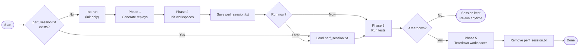
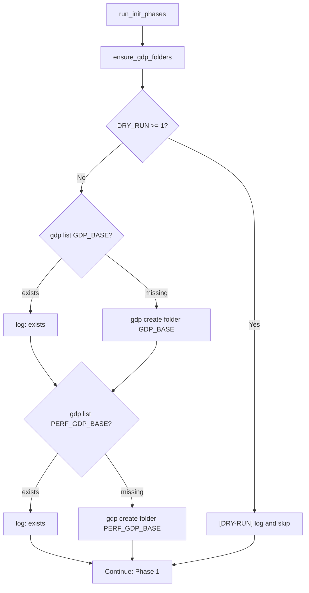

# CAT — Performance Test Framework (`perf_main.sh`) Improvements

> Detailed before-and-after comparison for the performance test workflow.
> Korean version: [IMPROVEMENTS_PERF_KR.md](IMPROVEMENTS_PERF_KR.md)
> Combined overview: [IMPROVEMENTS.md](IMPROVEMENTS.md)

---

## Overview

| Area | Legacy (`2_perf`) | Current |
|---|---|---|
| Entry point | `main.pl` (Perl 1-liner stub) | `perf_main.sh` — structured Bash, session-based |
| Workflow | Single-shot all-or-nothing | Init once → run many times → teardown when done |
| Session management | None | `perf_session.txt` stores workspace names |
| Workspace lookup | Hardcoded relative paths | `gdp find` dynamic lookup |
| Workspace types | MANAGED only | MANAGED + UNMANAGED (automatic setup) |
| Parallel execution | Sequential | `xargs -P` parallel, 3-phase model |
| Race condition | Unhandled (silent corruption) | `flock` serialises `gdp build workspace` |
| GDP folder setup | Manual prerequisite | `ensure_gdp_folders()` auto-creates on init |
| VSE invocation | Hardcoded `vse_sub` + `bwait` | `run_vse()` — `vse_run` / `vse_sub` switchable |
| Common libraries | Not supported | `-common LIB` appends to all test combos |
| Dry-run support | None | 3-level `DRY_RUN` |
| Replay generation | Inline with init | Separate Phase 1, can run standalone (`-gen-replay`) |
| Filtering at run time | Not possible | `-lib`, `-test`, `-mode` filter the session |

---

## 1. Session-Based Workflow

### Legacy — All or Nothing

```
main.pl
  │
  ├─ init ALL workspaces
  │    ├─ BM01 workspace
  │    ├─ BM02 workspace
  │    └─ ...
  │
  ├─ run ALL tests (immediately)
  │
  └─ teardown ALL workspaces
       └─ (one-shot, cannot re-run, cannot add/remove tests)
```

### Current — Decoupled Phases



**Key advantage:** workspaces are expensive to create (GDP project, library
population, workspace build). By separating init from run, you create the
workspaces once and run the performance test repeatedly — with different
filters, VSE modes, or job counts — without rebuilding the environment.

### Session File Format

```
perf_session.txt
──────────────────────────────────────────────────────────────
20260417_120000_username                 ← line 1: uniqueid
checkHier    BM01  perf_checkHier_BM01_20260417_120000_username
checkHier    BM02  perf_checkHier_BM02_20260417_120000_username
renameRefLib BM01  perf_renameRefLib_BM01_20260417_120000_username
──────────────────────────────────────────────────────────────
column 1: testtype   column 2: lib   column 3: ws_name
```

- **Line 1 (uniqueid):** used for `result/<uniqueid>/` and `CDS_log/<uniqueid>/` directories.
- **Line 2+ (ws_name):** the *exact* GDP workspace name — used for `gdp find` at run time.
  Storing the actual name (not just a timestamp) means the session survives
  across directory moves and is robust to clock skew.

---

## 2. Phase Structure

```
╔═══════════════════════════════════════════════════════════════════╗
║  perf_main.sh execution phases                                    ║
╠═══════════════════════════════════════════════════════════════════╣
║                                                                   ║
║  Phase 1 — Generate Replays                 [SEQUENTIAL]          ║
║  ─────────────────────────────────────────────────────────        ║
║  Script: perf_generate_replay.sh                                  ║
║  Input:  testtype, lib, cell                                      ║
║  Output: GenerateReplayScript/<testtype>_<lib>.au                 ║
║                                                                   ║
║  Must run sequentially (createReplay.pl tool limitation).         ║
║  Can run standalone: perf_main.sh -gen-replay                     ║
║                                                                   ║
║  Phase 2 — Init Workspaces                  [PARALLEL + flock]    ║
║  ─────────────────────────────────────────────────────────        ║
║  Script: perf_init.sh                                             ║
║  xargs -n3 -P<jobs>   (testtype lib cell per slot)                ║
║                                                                   ║
║  For each combo:                                                  ║
║    1. GDP create project / variant / libtype / config             ║
║    2. GDP create libraries                                        ║
║    3. [flock] gdp build workspace → WORKSPACES_MANAGED/           ║
║    4. Add symlinks (cdsLibMgr.il, .cdsenv)                        ║
║    5. Setup UNMANAGED workspace (cp cds.lib, mv oa/, patch tag)   ║
║    6. gdp rebuild workspace (restore MANAGED oa/)                 ║
║    7. Copy replay .au to both workspaces                          ║
║                                                                   ║
║  Phase 3 — Run Tests                        [PARALLEL]            ║
║  ─────────────────────────────────────────────────────────        ║
║  Script: perf_run_single.sh                                       ║
║  xargs -n4 -P<jobs>   (testtype lib mode ws_name per slot)        ║
║                                                                   ║
║  For each combo:                                                  ║
║    1. gdp find → MANAGED workspace path                           ║
║    2. Derive UNMANAGED path from MANAGED parent                   ║
║    3. run_vse() in the workspace directory                         ║
║    4. Write log to CDS_log/<uniqueid>/                            ║
║                                                                   ║
║  Phase 5 — Teardown                         [PARALLEL]            ║
║  ─────────────────────────────────────────────────────────        ║
║  Script: perf_teardown.sh                                         ║
║  xargs -n1 -P<jobs>   (ws_name per slot)                          ║
║                                                                   ║
║  For each workspace:                                              ║
║    1. gdp find → MANAGED path                                     ║
║    2. gdp delete workspace                                        ║
║    3. safe_rm_rf MANAGED dir                                      ║
║    4. safe_rm_rf UNMANAGED dir                                    ║
║                                                                   ║
╚═══════════════════════════════════════════════════════════════════╝
```

---

## 3. Parallel Execution

### Legacy

```
init.sh BM01       ────────────────────────────────►
init.sh BM02                                       ────────────────────────────────►
init.sh BM03                                                                       ────────►
# Sequential — total time = sum of all inits
```

### Current

```
Time ─────────────────────────────────────────────────────────►

Phase 1 (sequential):
  BM01 replay ──► BM02 replay ──► BM03 replay ──► BM04 replay

Phase 2 (parallel, flock at build):
  BM01: [create proj/lib ██████] [flock:HOLD][build ████][UNMANAGED ██]
  BM02: [create proj/lib ██████] [flock:WAIT ───────────][HOLD][build ████][UNMANAGED ██]
  BM03: [create proj/lib ██████] [flock:WAIT ──────────────────────────][HOLD][build ████]

Phase 3 (parallel):
  checkHier/BM01/managed   [run_vse ████████████████████████]
  checkHier/BM01/unmanaged [run_vse ████████████████████████]
  checkHier/BM02/managed   [run_vse ████████████████████████]
  checkHier/BM02/unmanaged [run_vse ████████████████████████]
```

### xargs Argument Mapping

| Phase | Flag | Arguments per slot | Receives |
|-------|------|--------------------|---------|
| Phase 2 Init | `-n3` | `testtype lib cell` | `$1 $2 $3` + `uniqueid` (extra arg via bash -c) |
| Phase 3 Run | `-n4` | `testtype lib mode ws_name` | `$1 $2 $3 $4` + `uniqueid` (extra arg) |
| Phase 5 Teardown | `-n1` | `ws_name` | `$1` |

---

## 4. Workspace Structure (MANAGED / UNMANAGED)

### Legacy

```
Single workspace type.
Path hardcoded to relative ../../workspaces/.
No UNMANAGED concept.
No symlink setup.
```

### Current

```
WORKSPACES_MANAGED/<ws_name>/
│
├── cds.lib                    ← library map (GDP-managed)
├── cds.libicm                 ← ICManage library map
├── oa/
│   └── <lib>/
│       ├── <cell>/            ← design data (synced by gdp build)
│       └── cdsinfo.tag        ← DMTYPE p4
│
├── cdsLibMgr.il ──symlink──►  $CDS_LIB_MGR   ← added after gdp build
├── .cdsenv      ──symlink──►  code/.cdsenv    ← added after gdp build
└── <testtype>_<lib>.au        ← replay file (copied from GenerateReplayScript/)


WORKSPACES_UNMANAGED/<ws_name>/
│
├── cds.lib                    ← copy of MANAGED's cds.libicm
├── oa/
│   └── <lib>/
│       ├── <cell>/            ← moved from MANAGED (not re-synced by GDP)
│       └── cdsinfo.tag        ← DMTYPE none  (patched from p4)
└── <testtype>_<lib>.au        ← replay file (copied)
```

### Setup Sequence

```
perf_init.sh
  │
  ├─ 1. [flock] gdp build workspace
  │         → WORKSPACES_MANAGED/<ws>/   (oa/ populated via p4 sync)
  │
  ├─ 2. ln -sf $CDS_LIB_MGR  MANAGED/<ws>/cdsLibMgr.il
  │    ln -sf code/.cdsenv    MANAGED/<ws>/.cdsenv
  │
  ├─ 3. mkdir -p WORKSPACES_UNMANAGED/<ws>/
  │    cp MANAGED/<ws>/cds.libicm → UNMANAGED/<ws>/cds.lib
  │
  ├─ 4. mv MANAGED/<ws>/oa/ → UNMANAGED/<ws>/oa/
  │
  ├─ 5. find UNMANAGED/<ws>/oa -name cdsinfo.tag:
  │         sed -i 's/DMTYPE p4/DMTYPE none/g'
  │
  └─ 6. gdp rebuild workspace (in MANAGED/<ws>/)
             → restores MANAGED/<ws>/oa/ from GDP
```

**Why two workspace types?**
MANAGED and UNMANAGED differ in how Virtuoso tracks library data:
- MANAGED: library under ICManage control (`DMTYPE p4`) — tests ICM-aware paths.
- UNMANAGED: library treated as local data (`DMTYPE none`) — tests non-ICM paths.
Both types are tested in every performance run.

---

## 5. Dynamic Workspace Lookup

### Legacy

```bash
# Hardcoded path — breaks if directory moves
managed_ws="../../workspaces/${ws_name}"
```

### Current

```bash
# perf_run_single.sh — location-independent lookup
ws_gdp_path=$(run_cmd "gdp find --type=workspace \":=${ws_name}\"")
managed_ws=$(run_cmd "gdp list \"${ws_gdp_path}\" --columns=rootDir")

# UNMANAGED derived from MANAGED parent (string substitution)
managed_parent="$(dirname "${managed_ws}")"
unmanaged_ws="${managed_parent/%WORKSPACES_MANAGED/WORKSPACES_UNMANAGED}/${ws_name}"
```

```
gdp find --type=workspace ":=perf_checkHier_BM01_20260417_120000_user"
  │
  └─► /MEMORY/TEST/CAT/.../perf_checkHier_BM01_...  (GDP path)
        │
        └─► gdp list --columns=rootDir
              │
              └─► /home/user/project/CAT/WORKSPACES_MANAGED/perf_checkHier_BM01_...
                    │
                    parent substitution:  WORKSPACES_MANAGED → WORKSPACES_UNMANAGED
                    │
                    └─► /home/user/project/CAT/WORKSPACES_UNMANAGED/perf_checkHier_BM01_...
```

---

## 6. Race Condition Fix — p4 Protect Table

### The Problem

`gdp build workspace` writes to the Perforce protect table on the server.
Parallel processes colliding on this write produce:

```
Cannot update the p4 protect table for <project>, see server logs for details
```

### Solution — flock on .gdp_ws_lock

```
Parallel perf_init.sh processes (xargs -P4):

TIME ──────────────────────────────────────────────────────────►

  BM01:  create proj/lib ████  [flock: ACQUIRE] build ██ [RELEASE]
  BM02:  create proj/lib ████  [flock: WAIT ─────────────────────] [ACQUIRE] build ██
  BM03:  create proj/lib ████  [flock: WAIT ──────────────────────────────────────────] [ACQUIRE] build

  ┌────────────────────────────────────────────────────────────┐
  │  gdp create project/library : fully parallel       ✓       │
  │  gdp build workspace        : serialised by flock  ✓       │
  │  UNMANAGED setup            : fully parallel       ✓       │
  │  gdp rebuild workspace      : fully parallel       ✓       │
  └────────────────────────────────────────────────────────────┘
```

```bash
# perf_init.sh — only the build step is inside the lock
(
    flock 9
    cd "${script_dir}/WORKSPACES_MANAGED"
    run_cmd "gdp build workspace --content \"${config}\" --gdp-name \"${ws_name}\" ..."
) 9>"${script_dir}/.gdp_ws_lock"

# gdp rebuild workspace does NOT write the protect table → outside the lock
(cd "${managed_ws}" && run_cmd "gdp rebuild workspace .")
```

---

## 7. GDP Folder Auto-Setup

### Legacy

```
GDP_BASE and PERF_GDP_BASE had to be created manually before init.
Missing folders caused cryptic errors deep in the init sequence.
```

### Current — ensure_gdp_folders()



Folders checked:
- `GDP_BASE` = `${GDP_BASE}` (e.g. `/MEMORY/TEST/CAT/CAT_WORKING/<user>`)
- `PERF_GDP_BASE` = `${GDP_BASE}/perf`

---

## 8. Common Libraries (`-common`)

### Problem

Some libraries need to exist in every workspace regardless of test type —
e.g. a shared reference library that all tests read from.
Legacy had no mechanism; manual editing of each init script was required.

### Current

```bash
# Add REF_LIB to every test combo
./perf_main.sh -no-run -lib BM01,BM02 -test checkHier,renameRefLib -common REF_LIB
```

```
perf_libs() expansion result + -common append:

  checkHier    / BM01  →  [ BM01 ]                            + [ REF_LIB ]
  checkHier    / BM02  →  [ BM02 ]                            + [ REF_LIB ]
  renameRefLib / BM01  →  [ BM01  BM01_ORIGIN  BM01_TARGET ]  + [ REF_LIB ]
  renameRefLib / BM02  →  [ BM02  BM02_ORIGIN  BM02_TARGET ]  + [ REF_LIB ]
                          └─── per-testtype expansion ──────┘    └─ added ─┘
```

- Multiple common libs: `-common LIB_A,LIB_B`
- Validated against `PERF_LIBS` at startup (same rules as `-lib`)
- Propagated via `PERF_COMMON_LIBS` env var to child `perf_init.sh` processes

---

## 9. Detailed Usage

```
./perf_main.sh [options]

  -h           | --help              Print help
  -lib           <lib[,lib,...]>     Libraries to test     (default: all PERF_LIBS)
  -test          <test[,test,...]>   Test types to run     (default: all PERF_TESTS)
  -mode          <managed|unmanaged> Workspace mode        (default: both)
  -common        <lib[,lib,...]>     Libraries added to ALL combos
  -j           | --jobs <n>          Parallel jobs         (default: 4)
  -d           | --dry-run [0|1|2]   Dry-run level         (default: $DRY_RUN)
  -gen-replay  | --gen-replay        Phase 1 only (generate replay files)
  -no-run      | --no-run            Init only (skip test execution)
  -t           | --teardown          Teardown after tests; remove session file
  -auto-init   | --auto-init         Auto-init if no session (skip prompt)
```

### Typical Workflows

```bash
# ── Replay files only (no workspace setup) ───────────────────────
./perf_main.sh -gen-replay -lib BM01 -test checkHier

# ── Step 1: Set up workspaces (done once) ────────────────────────
./perf_main.sh -no-run -lib BM01,BM02 -test checkHier,renameRefLib

# ── Step 2: Run tests — various filters ──────────────────────────
./perf_main.sh                                   # all session × both modes
./perf_main.sh -lib BM01                         # BM01 only × both modes
./perf_main.sh -test checkHier                   # checkHier × both modes
./perf_main.sh -lib BM01 -test checkHier         # BM01 × checkHier × both
./perf_main.sh -lib BM01 -mode managed           # BM01 × managed only
./perf_main.sh -mode unmanaged                   # all × unmanaged only

# ── Step 3: Teardown when done ───────────────────────────────────
./perf_main.sh -no-run -t

# ── One-shot (init → run → teardown) ─────────────────────────────
./perf_main.sh -auto-init -t -lib BM01 -test checkHier -d 0
```

### Option Combinations Table

```
Command                                                  Tests executed
───────────────────────────────────────────────────────  ─────────────────────────────
./perf_main.sh                                           all session × managed+unmanaged
./perf_main.sh -lib BM02 -test checkHier                 checkHier/BM02 × both     (2)
./perf_main.sh -lib BM02 -test checkHier -mode managed   checkHier/BM02/managed    (1)
./perf_main.sh -mode unmanaged                           all session × unmanaged
```

### Dry-Run Workflows (no infrastructure required)

```bash
# Print every command that would run
./perf_main.sh -d 2 -no-run -lib BM01 -test checkHier

# Smoke test: create mock workspace dirs locally
./perf_main.sh -d 1 -no-run -lib BM01 -test checkHier
./perf_main.sh -d 1 -lib BM01 -test checkHier
./perf_main.sh -d 1 -no-run -t   # teardown mock workspaces
```

### Runtime VSE Mode Switch

```bash
VSE_MODE=sub ./perf_main.sh -lib BM01 -test checkHier   # batch + bjobs poll
VSE_MODE=run ./perf_main.sh -lib BM01 -test checkHier   # synchronous
```

---

## 10. Key Files

| File | Role |
|---|---|
| `perf_main.sh` | Entry point — session lifecycle, phase orchestration, option parsing |
| `code/env.sh` | `PERF_LIBS`, `PERF_TESTS`, `PERF_PREFIX`, `PERF_GDP_BASE`, `VSE_MODE`, `DRY_RUN` |
| `code/common.sh` | `run_cmd()`, `run_vse()`, `log()`, `error_exit()`, `_mock_gdp_workspace()` |
| `code/perf_generate_replay.sh` | Phase 1 — generate `<testtype>_<lib>.au` replay file |
| `code/perf_init.sh` | Phase 2 — GDP create, build, MANAGED/UNMANAGED setup, symlinks |
| `code/perf_run_single.sh` | Phase 3 — `gdp find`, workspace select, `run_vse()` |
| `code/perf_teardown.sh` | Phase 5 — `gdp find`, `gdp delete`, `safe_rm_rf` |
| `code/summary.sh` | Parse `CDS_log/<uniqueid>/*.log` → pass/fail summary |
| `perf_session.txt` | Active session (gitignored) — uniqueid + ws_name entries |
