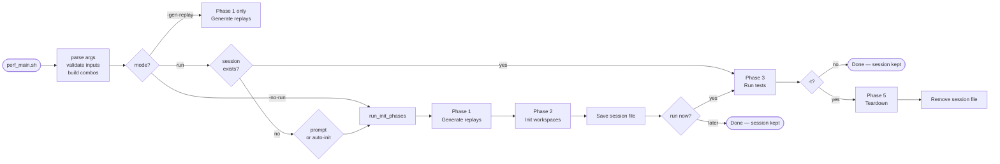

# CAT — Performance Test Framework Improvements
## `legacy/2_perf/main.pl` → `perf_main.sh`

> Korean version: [IMPROVEMENTS_PERF_KR.md](IMPROVEMENTS_PERF_KR.md)
> Combined overview: [IMPROVEMENTS.md](IMPROVEMENTS.md)

---

## Overview

| Area | Legacy (`2_perf/main.pl` + `main.template`) | Current (`perf_main.sh`) |
|---|---|---|
| Language | Perl + generated Bash | Pure Bash |
| Workflow | Generate template → fill → run generated script | Session-based: init → run (×N) → teardown |
| Workspace creation | Separate manual `ICM_createProj.sh` | Integrated Phase 2 (`perf_init.sh`) |
| UNMANAGED setup | `cp -rf` from MANAGED (data copy) | `mv oa/` + patch `cdsinfo.tag` + `gdp rebuild` |
| Workspace lookup | Hardcoded path `unmanaged/cadence_perf_ws` | `gdp find --type=workspace` dynamic lookup |
| Parallel execution | Sequential `for` loop | `xargs -P` parallel workers |
| Race condition | Not applicable (sequential) | `flock` serialises `gdp build workspace` |
| Session management | None — workspaces must pre-exist | `perf_session.txt` tracks workspace names |
| GDP folder setup | Manual prerequisite | `ensure_gdp_folders()` auto-creates |
| Replay generation | `createReplay.pl` (no mode/result args) | `createReplay.pl -manage <mode> -result <uniqueid>` |
| Replay output naming | `replay.<testtype>1.au` (single file) | `<testtype>_<lib>_<mode>.au` (per mode) |
| Run-time filtering | Fixed at template-fill time | `-lib`, `-test`, `-mode` filter at any run |
| Dry-run | None | 3-level `DRY_RUN` |
| Error handling | `set -e` only | `set -euo pipefail` + `error_exit` |

---

## 1. Architecture — Perl + Template vs Structured Bash

### Legacy — 3-Step Indirect Execution

```
main.pl
  │
  ├─ 1. Call createReplay.pl for each testtype
  │       → replay files in GenerateReplayScript/
  │       → copies to code/replay/
  │
  ├─ 2. Read main.template, substitute variables:
  │       man_folders=()        → man_folders=(managed unmanaged)
  │       virtuoso_version=     → virtuoso_version=IC251_ISR5-023_CAT
  │       replay_files=( )      → replay_files=(checkHier1.au renameRefLib1.au ...)
  │       → writes main.sh
  │       → chmod +x main.sh
  │
  └─ 3. if genOnly == 0: system("./main.sh")
            (workspaces must already exist — created manually beforehand)
```

```perl
# legacy/2_perf/main.pl (key section)
chdir "GenerateReplayScript";
system("\\rm replay*.au");
foreach my $key (@templates) {
    system("./createReplay.pl -lib \"$library\" -cell \"$cell\" -template $key\n");
}
system("cp -r GenerateReplayScript/replay*.au code/replay/");
# open template, substitute, write main.sh
open(maintmpl, "main.template") || die "can't open script Template\n";
...
system("chmod +x main.sh");
if ($genOnly == 1) { exit; }
else { system("./main.sh"); }
```

The generated `main.sh` ran a hardcoded loop over pre-existing workspaces.
Workspaces were assumed to exist at `managed/<ws_name>/` and `unmanaged/<ws_name>/`.

### Current — Structured Bash, All Phases Integrated



---

## 2. Workspace Setup — Manual vs Integrated

### Legacy — Manual, Sequential, No Rebuild

```bash
# legacy/2_perf/code/ICM_createProj.sh (must be run manually before main.pl)
# Library list HARDCODED in script:
libs=(DRAMLIB BM01 BM01_CHIP BM01_COPY BM01_ORIGIN BM01_TARGET BM02 ...)

gdp create project /VSM/$proj_name
gdp create variant /VSM/$proj_name/rev01
gdp create libtype /VSM/$proj_name/rev01/OA --libspec OA
gdp create config /VSM/$proj_name/rev01/dev

for lib in ${libs[@]}; do
    gdp create library /VSM/$proj_name/rev01/OA/$lib \
        --from /VSM/cadence_perf_20260317064432/rev01/OA/$lib ...
    gdp update /VSM/$proj_name/rev01/dev --add /VSM/$proj_name/rev01/OA/$lib
done

# Creating MANAGED workspace...
pushd managed
gdp build workspace --content /VSM/$proj_name/rev01/dev --gdp-name $ws_name --location $(realpath .)
popd

# Creating UNMANAGED workspace...  ← PROBLEM: just a directory copy
pushd unmanaged
cp -rf ../managed/$ws_name ./$ws_name    # copies all files including oa/
popd
```

Problems:
- Library list hardcoded — must edit script to change
- UNMANAGED is `cp -rf` of MANAGED: `cdsinfo.tag` still says `DMTYPE p4`
  → Virtuoso sees it as ICM-managed, defeating the purpose
- Run separately from replay generation
- No parallelism, no flock, no DRY_RUN
- No GDP path configuration (hardcoded `/VSM/...`)

### Current — Automated, Parallel, Correct UNMANAGED

```bash
# code/perf_init.sh (called via xargs -P from perf_main.sh)
# Library list built dynamically from testtype:
perf_libs() {
    case "${testtype}" in
        checkHier|replace|deleteAllMarker)  echo "${lib}" ;;
        renameRefLib)   echo "${lib} ${lib}_ORIGIN ${lib}_TARGET" ;;
        copyHierToEmpty) echo "${lib} ${lib}_CHIP ${lib}_COPY" ;;
        ...
    esac
}
IFS=' ' read -ra libs <<< "$(perf_libs "${testtype}" "${lib}")"
# append -common libs if specified
for _cl in ${PERF_COMMON_LIBS:-}; do libs+=("${_cl}"); done
```

```
UNMANAGED setup (correct):

  1. [flock] gdp build workspace  →  MANAGED/<ws>/oa/  (DMTYPE p4)
  2. cp cds.libicm  →  UNMANAGED/<ws>/cds.lib
  3. mv MANAGED/<ws>/oa/  →  UNMANAGED/<ws>/oa/
  4. sed -i 's/DMTYPE p4/DMTYPE none/g'  cdsinfo.tag   ← patch
  5. gdp rebuild workspace (MANAGED)  →  restore MANAGED/<ws>/oa/
```

`DMTYPE none` means Virtuoso treats the library as purely local —
correct behaviour for the unmanaged test case.

---

## 3. Workspace Lookup — Hardcoded vs Dynamic

### Legacy — Hardcoded Rename Trick

```bash
# legacy/2_perf/main.template (generated main.sh)
# UNMANAGED workspace assumed at a FIXED path
if [[ " ${man_folders[*]} " == *" unmanaged "* ]]; then
    if [ -d $(pwd)/unmanaged/cadence_perf_ws ]; then
        echo "Moving unmanaged/cadence_perf_ws TO unmanaged/$ws_name"
        mv unmanaged/cadence_perf_ws unmanaged/$ws_name   # rename to match ws_name
    elif [ ! -d $(pwd)/unmanaged/cadence_perf_ws ]; then
        echo "Please check the workspace in $(pwd)/unmanaged"
        echo "It should have unmanaged/cadence_perf_ws"
        exit 1
    fi
fi
# After run, rename back:
mv unmanaged/$ws_name unmanaged/cadence_perf_ws
```

The unmanaged workspace path was always `unmanaged/cadence_perf_ws` — a single
fixed location that had to be renamed before and after each run. This made
parallel execution impossible.

### Current — GDP find + Path Derivation

```bash
# code/perf_run_single.sh
ws_gdp_path=$(run_cmd "gdp find --type=workspace \":=${ws_name}\"")
managed_ws=$(run_cmd "gdp list \"${ws_gdp_path}\" --columns=rootDir")
unmanaged_ws="${managed_parent/%WORKSPACES_MANAGED/WORKSPACES_UNMANAGED}/${ws_name}"
```

```
gdp find ":=perf_checkHier_BM01_20260417_120000_user"
  └─► GDP path → gdp list --columns=rootDir
        └─► /project/CAT/WORKSPACES_MANAGED/perf_checkHier_BM01_...
              └─► substitute WORKSPACES_MANAGED → WORKSPACES_UNMANAGED
                    └─► /project/CAT/WORKSPACES_UNMANAGED/perf_checkHier_BM01_...
```

Multiple workspaces can coexist and run in parallel — no rename trick needed.

---

## 4. Race Condition — p4 Protect Table

### Legacy — No Parallel Init → No Problem

ICM_createProj.sh ran sequentially: one call created all libraries and
one `gdp build workspace`. No concurrency, no collision.

### Current — flock Serialises the Dangerous Step

When Phase 2 runs with `xargs -P4`, multiple `perf_init.sh` processes call
`gdp build workspace` simultaneously. This writes to the Perforce protect table
on the server, causing:

```
Cannot update the p4 protect table for <project>, see server logs for details
```

Solution: `flock` on a shared lock file — only the build step is serialised:

```bash
# code/perf_init.sh
(
    flock 9
    cd "${script_dir}/WORKSPACES_MANAGED"
    run_cmd "gdp build workspace --content \"${config}\" ..."
) 9>"${script_dir}/.gdp_ws_lock"
# gdp rebuild (restore oa) does NOT write protect table → runs in parallel
```

```
TIME ──────────────────────────────────────────────────────────►
  BM01: create proj/lib ████  [LOCK] build ██ [UNLOCK]
  BM02: create proj/lib ████  [WAIT ──────────────────] [LOCK] build ██
  BM03: create proj/lib ████  [WAIT ───────────────────────────────────] [LOCK] build ██
        ← parallel ──────────►← serialised →←──── parallel ────────────►
```

---

## 5. Session Management

### Legacy — No Session, Workspaces Must Pre-Exist

```perl
# main.pl: no session concept
# Workspaces created separately by ICM_createProj.sh
# main.pl generates main.sh which assumes workspaces exist at fixed paths
# No way to know which workspace corresponds to which run
# After main.sh runs, there is no record of what was created
```

### Current — Session File Tracks Everything

```
perf_session.txt
────────────────────────────────────────────────────────────────────
20260417_120000_username                    ← uniqueid (log dir names)
checkHier    BM01  perf_checkHier_BM01_20260417_120000_username
checkHier    BM02  perf_checkHier_BM02_20260417_120000_username
renameRefLib BM01  perf_renameRefLib_BM01_20260417_120000_username
────────────────────────────────────────────────────────────────────
```

The session file is written after Phase 2 (init). Phase 3 (run) reads it.
This enables:
- **Re-run without re-init**: just run `./perf_main.sh` again (reads session)
- **Filtered re-run**: `-lib BM01`, `-mode managed`, `-test checkHier`
- **Teardown by name**: each workspace name is stored — no guesswork

---

## 6. Replay Generation

### Legacy — One File Per Testtype

```perl
# main.pl
foreach my $key (@templates) {
    system("./createReplay.pl -lib \"$library\" -cell \"$cell\" -template $key\n");
}
# Output: replay.checkHier1.au, replay.renameRefLib1.au, ...
# Copied to code/replay/ — same file used for both managed and unmanaged
```

`createReplay.pl` had no concept of workspace mode.
The same replay was used regardless of managed/unmanaged context.

### Current — One File Per Mode

```bash
# code/perf_generate_replay.sh
perl createReplay.pl \
    -lib "${lib}" -cell "${cell}" -template "${testtype}" \
    -manage "${mode}" \     ← new: "managed" or "unmanaged"
    -result "${uniqueid}"   ← new: result path identifier
mv "replay.${testtype}_${lib}_${mode}.au" "${testtype}_${lib}_${mode}.au"
```

```
Phase 1 generates (per combo):
  checkHier_BM01_managed.au     ─► copied to WORKSPACES_MANAGED/<ws>/
  checkHier_BM01_unmanaged.au   ─► copied to WORKSPACES_UNMANAGED/<ws>/
```

Each workspace gets the replay file generated specifically for its mode.

---

## 7. Parallel Execution

### Legacy — Sequential

```bash
# main.template (generated main.sh)
for managed in ${man_folders[@]}; do
    for replay in ${replay_files[@]}; do
        (
            cd $testdir || exit 1
            vse_run -v $virtuoso_version \
                -replay ../../code/replay/$replay \
                -log ../../CDS_log/$replay"_"$managed".log"
        )
    done
done
# managed loop is outer → all unmanaged tests, then all managed tests (or vice versa)
# Sequential — no parallelism
```

### Current — Three Phases, Each With xargs -P

```
Phase 1 — Generate replays (SEQUENTIAL — tool limitation)
  BM01/managed → BM01/unmanaged → BM02/managed → BM02/unmanaged → ...

Phase 2 — Init workspaces (PARALLEL)
  xargs -n3 -P4:  (testtype lib cell) per slot
  BM01 ──────────────────────────────────────────────────────►
  BM02 ──────────────────────────────────────────────────────►
  BM03 ──────────────────────────────────────────────────────►

Phase 3 — Run tests (PARALLEL)
  xargs -n4 -P4:  (testtype lib mode ws_name) per slot
  checkHier/BM01/managed   ██████████████████████████
  checkHier/BM01/unmanaged ██████████████████████████
  checkHier/BM02/managed   ██████████████████████████
  checkHier/BM02/unmanaged ██████████████████████████
```

---

## 8. Detailed Usage Comparison

### Legacy

```
main.pl [options]
  -lib      Library names (space-separated)
  -cell     Cell names (space-separated, paired with lib)
  -mode     Test types (default: all templates)
  -manage   managed / unmanaged / "unmanaged managed"
  -ws       Workspace name
  -proj     Project prefix
  -id       Unique ID file
  -version  Virtuoso version (REQUIRED)
  -genOnly  1 = generate only (default), 0 = generate + run
```

No DRY_RUN. `--version` required on every invocation. No session concept.
Run twice → need to set up workspaces again.

### Current

```
./perf_main.sh [options]
  -h           | --help              Print help
  -lib           <lib[,lib,...]>     Libraries to test      (default: all PERF_LIBS)
  -test          <test[,test,...]>   Test types to run      (default: all PERF_TESTS)
  -mode          <managed|unmanaged> Workspace mode         (default: both)
  -common        <lib[,lib,...]>     Libraries added to ALL combos
  -j           | --jobs <n>          Parallel workers       (default: 4)
  -d           | --dry-run [0|1|2]   Dry-run level          (default: $DRY_RUN)
  -gen-replay  | --gen-replay        Phase 1 only
  -no-run      | --no-run            Init only; save session
  -t           | --teardown          Teardown + remove session file
  -auto-init   | --auto-init         Auto-init if no session
```

**Typical workflow:**

```bash
# Step 1: init (once)
./perf_main.sh -no-run -lib BM01,BM02 -test checkHier,renameRefLib

# Step 2: run (repeat with different filters)
./perf_main.sh                                   # all
./perf_main.sh -lib BM01 -mode managed           # filtered
./perf_main.sh -test checkHier                   # filtered

# Step 3: teardown (when done)
./perf_main.sh -no-run -t
```

**Option combinations:**

```
Command                                                  Tests executed
───────────────────────────────────────────────────────  ─────────────────────────────
./perf_main.sh                                           all session × managed+unmanaged
./perf_main.sh -lib BM02 -test checkHier                 checkHier/BM02 × both     (2)
./perf_main.sh -lib BM02 -test checkHier -mode managed   checkHier/BM02/managed    (1)
./perf_main.sh -mode unmanaged                           all session × unmanaged
```

---

## 9. Key File Changes

| File | Legacy | Current |
|---|---|---|
| `main.pl` | Perl: generate replay → fill template → run | Replaced by `perf_main.sh` |
| `main.template` | Bash template with placeholders | Replaced — logic is in `perf_main.sh` |
| `perf_main.sh` | Did not exist | Full Bash rewrite: session-based, phased, parallel |
| `code/ICM_createProj.sh` | Manual: hardcoded lib list, sequential, `cp -rf` UNMANAGED | Replaced by `code/perf_init.sh` |
| `code/perf_init.sh` | Not present | Phase 2: dynamic libs, flock, correct UNMANAGED setup |
| `code/perf_run_single.sh` | Not present | Phase 3: `gdp find`, workspace select, `run_vse()` |
| `code/perf_teardown.sh` | `ICM_deleteProj.sh` (basic) | `gdp find` dynamic lookup, graceful not-found |
| `code/perf_generate_replay.sh` | Not present (createReplay.pl called inline) | Phase 1: wraps createReplay.pl with `-manage`/`-result` |
| `code/env.sh` | Not present — all vars inline in generated main.sh | Central: `PERF_LIBS`, `PERF_TESTS`, `PERF_GDP_BASE`, `VSE_MODE` |
| `code/common.sh` | Not present | `run_cmd()`, `run_vse()`, `log()`, `_mock_gdp_workspace()` |
