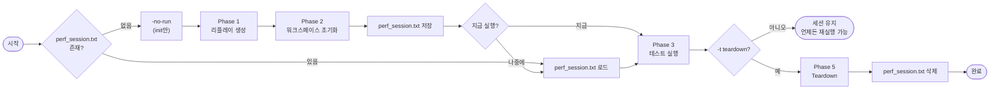
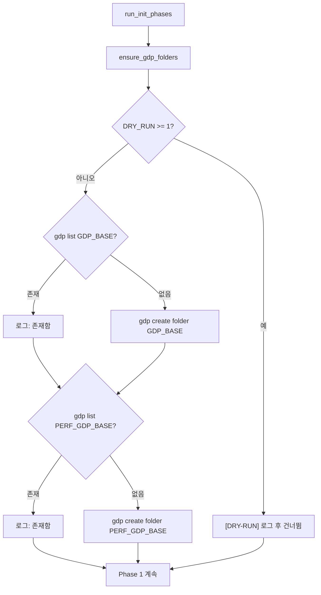

# CAT — 성능 테스트 프레임워크 (`perf_main.sh`) 개선 내용

> 성능 테스트 워크플로우의 Before-and-After 비교 문서입니다.
> English version: [IMPROVEMENTS_PERF.md](IMPROVEMENTS_PERF.md)
> 통합 문서: [IMPROVEMENTS_KR.md](IMPROVEMENTS_KR.md)

---

## 개요

| 항목 | Legacy (`2_perf`) | 현재 |
|---|---|---|
| 진입점 | `main.pl` (Perl 1줄 스텁) | `perf_main.sh` — 구조화된 Bash, 세션 기반 |
| 워크플로우 | 단발성, 모두 또는 없음 | Init 한 번 → 여러 번 run → 원하는 시점에 teardown |
| 세션 관리 | 없음 | `perf_session.txt` 에 워크스페이스 이름 저장 |
| 워크스페이스 조회 | 하드코딩된 상대 경로 | `gdp find` 동적 조회 |
| 워크스페이스 타입 | MANAGED만 | MANAGED + UNMANAGED (자동 설정) |
| 병렬 실행 | 순차 | `xargs -P` 병렬, 3단계 모델 |
| 경쟁 조건 | 처리 없음 (조용한 손상) | `flock`으로 `gdp build workspace` 직렬화 |
| GDP 폴더 설정 | 수동 사전 작업 | `ensure_gdp_folders()` init 시 자동 생성 |
| VSE 호출 | `vse_sub` + `bwait` 하드코딩 | `run_vse()` — `vse_run` / `vse_sub` 전환 가능 |
| 공통 라이브러리 | 미지원 | `-common LIB` 으로 모든 테스트 콤보에 추가 |
| Dry-run 지원 | 없음 | 3단계 `DRY_RUN` |
| 리플레이 생성 | init 내에 인라인 | 독립된 Phase 1, 단독 실행 가능 (`-gen-replay`) |
| 실행 시 필터링 | 불가 | `-lib`, `-test`, `-mode`로 세션 필터링 |

---

## 1. 세션 기반 워크플로우

### Legacy — 단발성

```
main.pl
  │
  ├─ 전체 워크스페이스 초기화
  │    ├─ BM01 워크스페이스
  │    ├─ BM02 워크스페이스
  │    └─ ...
  │
  ├─ 전체 테스트 즉시 실행
  │
  └─ 전체 워크스페이스 삭제
       └─ (단발성, 재실행 불가, 테스트 추가/제거 불가)
```

### 현재 — 단계 분리



**핵심 장점:** 워크스페이스 생성은 비용이 큰 작업입니다 (GDP 프로젝트 생성, 라이브러리
채우기, 워크스페이스 빌드). Init과 실행을 분리함으로써 워크스페이스를 한 번만 만들고
성능 테스트를 여러 번 반복할 수 있습니다 — 다른 필터, VSE 모드, 잡 수로 —
환경을 다시 구축하지 않고도 가능합니다.

### 세션 파일 형식

```
perf_session.txt
──────────────────────────────────────────────────────────────
20260417_120000_username                 ← 1행: uniqueid
checkHier    BM01  perf_checkHier_BM01_20260417_120000_username
checkHier    BM02  perf_checkHier_BM02_20260417_120000_username
renameRefLib BM01  perf_renameRefLib_BM01_20260417_120000_username
──────────────────────────────────────────────────────────────
1열: testtype   2열: lib   3열: ws_name
```

- **1행 (uniqueid):** `result/<uniqueid>/`, `CDS_log/<uniqueid>/` 디렉토리명으로 사용
- **2행~ (ws_name):** *실제* GDP 워크스페이스 이름 — 실행 시 `gdp find`에 사용됩니다.
  타임스탬프만이 아닌 실제 이름을 저장하므로 디렉토리 이동 후에도 세션이 유효하고
  시계 오차에도 강건합니다.

---

## 2. 단계 구조

```
╔═══════════════════════════════════════════════════════════════════╗
║  perf_main.sh 실행 단계                                           ║
╠═══════════════════════════════════════════════════════════════════╣
║                                                                   ║
║  Phase 1 — 리플레이 생성                        [순차]            ║
║  ─────────────────────────────────────────────────────────        ║
║  스크립트: perf_generate_replay.sh                                ║
║  입력:    testtype, lib, cell, mode (managed|unmanaged), uniqueid ║
║  출력:    GenerateReplayScript/<testtype>_<lib>_<mode>.au         ║
║          (모드별 개별 파일 — managed / unmanaged 각 1개)           ║
║                                                                   ║
║  createReplay.pl 호출 옵션:                                       ║
║    -managed <mode>    (managed | unmanaged)                       ║
║    -result  <uniqueid>                                            ║
║                                                                   ║
║  createReplay.pl 툴 제약으로 순차 실행 필요.                       ║
║  단독 실행 가능: perf_main.sh -gen-replay                         ║
║                                                                   ║
║  Phase 2 — 워크스페이스 초기화           [병렬 + flock]           ║
║  ─────────────────────────────────────────────────────────        ║
║  스크립트: perf_init.sh                                           ║
║  xargs -n3 -P<jobs>   (testtype lib cell per slot)                ║
║                                                                   ║
║  각 콤보에 대해:                                                   ║
║    1. GDP 프로젝트 / variant / libtype / config 생성              ║
║    2. GDP 라이브러리 생성                                         ║
║    3. [flock] gdp build workspace → WORKSPACES_MANAGED/           ║
║    4. 심볼릭 링크 추가 (cdsLibMgr.il, .cdsenv)                    ║
║    5. UNMANAGED 설정 (cds.lib 복사, oa/ 이동, tag 패치)           ║
║    6. gdp rebuild workspace (MANAGED oa/ 복원)                    ║
║    7. 리플레이 .au 파일 양쪽 워크스페이스에 복사                   ║
║                                                                   ║
║  Phase 3 — 테스트 실행                          [병렬]            ║
║  ─────────────────────────────────────────────────────────        ║
║  스크립트: perf_run_single.sh                                     ║
║  xargs -n4 -P<jobs>   (testtype lib mode ws_name per slot)        ║
║                                                                   ║
║  각 콤보에 대해:                                                   ║
║    1. gdp find → MANAGED 워크스페이스 경로                        ║
║    2. MANAGED 부모 경로에서 UNMANAGED 경로 파생                    ║
║    3. 워크스페이스 디렉토리 안에서 run_vse() 실행                  ║
║    4. CDS_log/<uniqueid>/ 에 로그 기록                            ║
║                                                                   ║
║  Phase 5 — Teardown                             [병렬]            ║
║  ─────────────────────────────────────────────────────────        ║
║  스크립트: perf_teardown.sh                                       ║
║  xargs -n1 -P<jobs>   (ws_name per slot)                          ║
║                                                                   ║
║  각 워크스페이스에 대해:                                           ║
║    1. gdp find → MANAGED 경로                                     ║
║    2. gdp delete workspace                                        ║
║    3. safe_rm_rf MANAGED 디렉토리                                 ║
║    4. safe_rm_rf UNMANAGED 디렉토리                               ║
║                                                                   ║
╚═══════════════════════════════════════════════════════════════════╝
```

---

## 3. 병렬 실행

### Legacy

```
init.sh BM01       ────────────────────────────────►
init.sh BM02                                       ────────────────────────────────►
init.sh BM03                                                                       ────────►
# 순차 — 총 시간 = 모든 init 시간의 합
```

### 현재

```
시간 ─────────────────────────────────────────────────────────►

Phase 1 (순차):
  BM01/managed ──► BM01/unmanaged ──► BM02/managed ──► BM02/unmanaged ──► ...

Phase 2 (병렬, build 시 flock):
  BM01: [프로젝트/라이브러리 생성 ██████] [flock:획득][build ████][UNMANAGED ██]
  BM02: [프로젝트/라이브러리 생성 ██████] [flock:대기 ──────────][획득][build ████][UNMANAGED ██]
  BM03: [프로젝트/라이브러리 생성 ██████] [flock:대기 ──────────────────────────][획득][build ████]

Phase 3 (병렬):
  checkHier/BM01/managed   [run_vse ████████████████████████]
  checkHier/BM01/unmanaged [run_vse ████████████████████████]
  checkHier/BM02/managed   [run_vse ████████████████████████]
  checkHier/BM02/unmanaged [run_vse ████████████████████████]
```

### xargs 인수 매핑

| 단계 | 플래그 | 슬롯당 인수 | 수신값 |
|------|--------|------------|--------|
| Phase 2 Init | `-n3` | `testtype lib cell` | `$1 $2 $3` + `uniqueid` (bash -c로 추가 전달) |
| Phase 3 Run | `-n4` | `testtype lib mode ws_name` | `$1 $2 $3 $4` + `uniqueid` (추가 전달) |
| Phase 5 Teardown | `-n1` | `ws_name` | `$1` |

---

## 4. 워크스페이스 구조 (MANAGED / UNMANAGED)

### Legacy

```
단일 워크스페이스 타입만 지원.
경로가 상대 경로 ../../workspaces/ 로 하드코딩.
UNMANAGED 개념 없음.
심볼릭 링크 자동 설정 없음.
```

### 현재

```
WORKSPACES_MANAGED/<ws_name>/
│
├── cds.lib                    ← 라이브러리 맵 (GDP 관리)
├── cds.libicm                 ← ICManage 라이브러리 맵
├── oa/
│   └── <lib>/
│       ├── <cell>/            ← 설계 데이터 (gdp build로 sync)
│       └── cdsinfo.tag        ← DMTYPE p4
│
├── cdsLibMgr.il ──심볼릭──►  $CDS_LIB_MGR   ← gdp build 후 추가
├── .cdsenv      ──심볼릭──►  code/.cdsenv    ← gdp build 후 추가
└── <testtype>_<lib>.au        ← 리플레이 파일 (GenerateReplayScript/<testtype>_<lib>_managed.au에서 복사)


WORKSPACES_UNMANAGED/<ws_name>/
│
├── cds.lib                    ← MANAGED의 cds.libicm 복사본
├── oa/
│   └── <lib>/
│       ├── <cell>/            ← MANAGED에서 이동 (GDP re-sync 없음)
│       └── cdsinfo.tag        ← DMTYPE none  (p4에서 패치됨)
└── <testtype>_<lib>.au        ← 리플레이 파일 (복사)
```

### 설정 순서

```
perf_init.sh
  │
  ├─ 1. [flock] gdp build workspace
  │         → WORKSPACES_MANAGED/<ws>/   (oa/ p4 sync으로 채워짐)
  │
  ├─ 2. MANAGED 워크스페이스에 심볼릭 링크 추가
  │       ln -sf $CDS_LIB_MGR  MANAGED/<ws>/cdsLibMgr.il
  │       ln -sf code/.cdsenv    MANAGED/<ws>/.cdsenv
  │
  ├─ 3. mkdir -p WORKSPACES_UNMANAGED/<ws>/
  │    cp MANAGED/<ws>/cds.libicm → UNMANAGED/<ws>/cds.lib
  │
  ├─ 4. mv MANAGED/<ws>/oa/ → UNMANAGED/<ws>/oa/
  │
  ├─ 5. UNMANAGED/<ws>/oa 아래 모든 cdsinfo.tag:
  │         sed -i 's/DMTYPE p4/DMTYPE none/g'
  │
  └─ 6. gdp rebuild workspace (MANAGED/<ws>/ 안에서)
             → MANAGED/<ws>/oa/ GDP에서 복원
```

**두 가지 워크스페이스 타입이 필요한 이유:**
MANAGED와 UNMANAGED는 Virtuoso가 라이브러리 데이터를 추적하는 방식이 다릅니다:
- MANAGED: ICManage 제어 하의 라이브러리 (`DMTYPE p4`) — ICM 경로 테스트
- UNMANAGED: 로컬 데이터로 취급 (`DMTYPE none`) — 비-ICM 경로 테스트
모든 성능 실행에서 두 타입이 모두 테스트됩니다.

---

## 5. 동적 워크스페이스 조회

### Legacy

```bash
# 하드코딩 경로 — 디렉토리 이동 시 깨짐
managed_ws="../../workspaces/${ws_name}"
```

### 현재

```bash
# perf_run_single.sh — 위치 독립적 조회
ws_gdp_path=$(run_cmd "gdp find --type=workspace \":=${ws_name}\"")
managed_ws=$(run_cmd "gdp list \"${ws_gdp_path}\" --columns=rootDir")

# UNMANAGED는 MANAGED 부모에서 문자열 치환으로 파생
managed_parent="$(dirname "${managed_ws}")"
unmanaged_ws="${managed_parent/%WORKSPACES_MANAGED/WORKSPACES_UNMANAGED}/${ws_name}"
```

```
gdp find --type=workspace ":=perf_checkHier_BM01_20260417_120000_user"
  │
  └─► /MEMORY/TEST/CAT/.../perf_checkHier_BM01_...  (GDP 경로)
        │
        └─► gdp list --columns=rootDir
              │
              └─► /home/user/project/CAT/WORKSPACES_MANAGED/perf_checkHier_BM01_...
                    │
                    부모 경로 치환:  WORKSPACES_MANAGED → WORKSPACES_UNMANAGED
                    │
                    └─► /home/user/project/CAT/WORKSPACES_UNMANAGED/perf_checkHier_BM01_...
```

---

## 6. 경쟁 조건 수정 — p4 Protect Table

### 문제

`gdp build workspace`는 Perforce 서버의 protect table에 쓰기를 수행합니다.
병렬 프로세스들이 동시에 이를 호출하면 다음 오류가 발생합니다:

```
Cannot update the p4 protect table for <project>, see server logs for details
```

### 해결 — .gdp_ws_lock에 flock 적용

```
병렬 perf_init.sh 프로세스 (xargs -P4):

시간 ──────────────────────────────────────────────────────────►

  BM01:  프로젝트/라이브러리 생성 ████  [flock: 획득] build ██ [해제]
  BM02:  프로젝트/라이브러리 생성 ████  [flock: 대기 ─────────────────] [획득] build ██ [해제]
  BM03:  프로젝트/라이브러리 생성 ████  [flock: 대기 ──────────────────────────────────] [획득] build

  ┌────────────────────────────────────────────────────────────┐
  │  gdp 프로젝트/라이브러리 생성: 완전 병렬               ✓   │
  │  gdp build workspace: flock으로 직렬화                ✓   │
  │  UNMANAGED 설정: 완전 병렬                             ✓   │
  │  gdp rebuild workspace: 완전 병렬                     ✓   │
  └────────────────────────────────────────────────────────────┘
```

```bash
# perf_init.sh — build 단계만 잠금 안에서 실행
(
    flock 9
    cd "${script_dir}/WORKSPACES_MANAGED"
    run_cmd "gdp build workspace --content \"${config}\" --gdp-name \"${ws_name}\" ..."
) 9>"${script_dir}/.gdp_ws_lock"

# gdp rebuild workspace는 protect table 쓰기 없음 → 잠금 밖에서 병렬 실행
(cd "${managed_ws}" && run_cmd "gdp rebuild workspace .")
```

---

## 7. GDP 폴더 자동 설정

### Legacy

```
GDP_BASE와 PERF_GDP_BASE를 init 전에 수동으로 생성해야 했습니다.
폴더가 없으면 init 시퀀스 깊은 곳에서 원인 불명의 gdp 오류가 발생했습니다.
```

### 현재 — ensure_gdp_folders()



확인하는 폴더:
- `GDP_BASE` = `${GDP_BASE}` (예: `/MEMORY/TEST/CAT/CAT_WORKING/<user>`)
- `PERF_GDP_BASE` = `${GDP_BASE}/perf`

---

## 8. 공통 라이브러리 (`-common`)

### 문제

테스트 타입과 관계없이 모든 워크스페이스에 포함되어야 하는 라이브러리가 있습니다.
예를 들어 모든 테스트가 읽는 참조 라이브러리입니다.
Legacy에는 이 메커니즘이 없어 각 init 스크립트에 수동으로 추가해야 했습니다.

### 현재

```bash
# REF_LIB를 모든 테스트 콤보에 추가
./perf_main.sh -no-run -lib BM01,BM02 -test checkHier,renameRefLib -common REF_LIB
```

```
perf_libs() 확장 결과 + -common 추가:

  checkHier    / BM01  →  [ BM01 ]                            + [ REF_LIB ]
  checkHier    / BM02  →  [ BM02 ]                            + [ REF_LIB ]
  renameRefLib / BM01  →  [ BM01  BM01_ORIGIN  BM01_TARGET ]  + [ REF_LIB ]
  renameRefLib / BM02  →  [ BM02  BM02_ORIGIN  BM02_TARGET ]  + [ REF_LIB ]
                          └─── testtype별 확장 ──────────────┘   └─ 추가 ─┘
```

- 쉼표로 여러 개 지정 가능: `-common LIB_A,LIB_B`
- 시작 시 `PERF_LIBS` 기준으로 유효성 검사 (`-lib`와 동일 규칙)
- `PERF_COMMON_LIBS` 환경 변수로 자식 `perf_init.sh` 프로세스에 전달

---

## 9. 상세 사용법

```
./perf_main.sh [옵션]

  -h           | --help              도움말 출력
  -lib           <lib[,lib,...]>     테스트할 라이브러리    (기본값: 전체 PERF_LIBS)
  -test          <test[,test,...]>   실행할 테스트 타입     (기본값: 전체 PERF_TESTS)
  -mode          <managed|unmanaged> 워크스페이스 모드      (기본값: 둘 다)
  -common        <lib[,lib,...]>     모든 콤보에 추가할 공통 라이브러리
  -j           | --jobs <n>          병렬 잡 수             (기본값: 4)
  -d           | --dry-run [0|1|2]   Dry-run 레벨           (기본값: $DRY_RUN)
  -gen-replay  | --gen-replay        Phase 1만 (리플레이 파일 생성)
  -no-run      | --no-run            Init만 (테스트 실행 건너뜀)
  -t           | --teardown          테스트 후 teardown; 세션 파일 삭제
  -auto-init   | --auto-init         세션 없으면 자동 init (프롬프트 없음)
```

### 주요 워크플로우

```bash
# ── 리플레이 파일만 생성 (워크스페이스 설정 없음) ────────────────
./perf_main.sh -gen-replay -lib BM01 -test checkHier

# ── Step 1: 워크스페이스 설정 (한 번만) ──────────────────────────
./perf_main.sh -no-run -lib BM01,BM02 -test checkHier,renameRefLib

# ── Step 2: 테스트 실행 — 다양한 필터 ───────────────────────────
./perf_main.sh                                   # 전체 세션 × 두 모드
./perf_main.sh -lib BM01                         # BM01만 × 두 모드
./perf_main.sh -test checkHier                   # checkHier × 두 모드
./perf_main.sh -lib BM01 -test checkHier         # BM01 × checkHier × 두 모드
./perf_main.sh -lib BM01 -mode managed           # BM01 × managed만
./perf_main.sh -mode unmanaged                   # 전체 × unmanaged만

# ── Step 3: 완료 후 teardown ─────────────────────────────────────
./perf_main.sh -no-run -t

# ── 원샷 (init → run → teardown) ────────────────────────────────
./perf_main.sh -auto-init -t -lib BM01 -test checkHier -d 0
```

### 옵션 조합표

```
명령                                                     실행되는 테스트
───────────────────────────────────────────────────────  ─────────────────────────────
./perf_main.sh                                           전체 세션 × managed+unmanaged
./perf_main.sh -lib BM02 -test checkHier                 checkHier/BM02 × 둘 다   (2건)
./perf_main.sh -lib BM02 -test checkHier -mode managed   checkHier/BM02/managed   (1건)
./perf_main.sh -mode unmanaged                           전체 세션 × unmanaged만
```

### Dry-run (인프라 불필요)

```bash
# 실행될 모든 명령 출력 — 실제 실행 없음
./perf_main.sh -d 2 -no-run -lib BM01 -test checkHier

# 로컬 목업 워크스페이스로 스모크 테스트
./perf_main.sh -d 1 -no-run -lib BM01 -test checkHier
./perf_main.sh -d 1 -lib BM01 -test checkHier
./perf_main.sh -d 1 -no-run -t   # 목업 워크스페이스 teardown
```

### VSE 모드 런타임 전환

```bash
VSE_MODE=sub ./perf_main.sh -lib BM01 -test checkHier   # 배치 제출 + bjobs 폴링
VSE_MODE=run ./perf_main.sh -lib BM01 -test checkHier   # 동기 실행
```

---

## 10. 주요 파일

| 파일 | 역할 |
|---|---|
| `perf_main.sh` | 진입점 — 세션 라이프사이클, 단계 조율, 옵션 파싱 |
| `code/env.sh` | `PERF_LIBS`, `PERF_TESTS`, `PERF_PREFIX`, `PERF_GDP_BASE`, `VSE_MODE`, `DRY_RUN` |
| `code/common.sh` | `run_cmd()`, `run_vse()`, `log()`, `error_exit()`, `_mock_gdp_workspace()` |
| `code/perf_generate_replay.sh` | Phase 1 — `<testtype>_<lib>_<mode>.au` 리플레이 파일 생성 (모드별 개별) |
| `code/perf_init.sh` | Phase 2 — GDP 생성, build, MANAGED/UNMANAGED 설정, 심볼릭 링크 |
| `code/perf_run_single.sh` | Phase 3 — `gdp find`, 워크스페이스 선택, `run_vse()` |
| `code/perf_teardown.sh` | Phase 5 — `gdp find`, `gdp delete`, `safe_rm_rf` |
| `code/summary.sh` | `CDS_log/<uniqueid>/*.log` 파싱 → pass/fail 요약 |
| `perf_session.txt` | 활성 세션 (gitignore) — uniqueid + ws_name 항목 |
