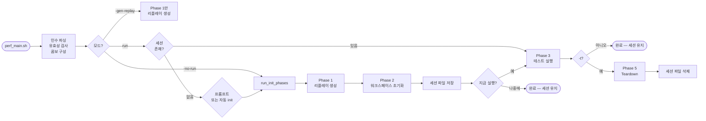

# CAT — 성능 테스트 프레임워크 개선 내용
## `legacy/2_perf/main.pl` → `perf_main.sh`

> English version: [IMPROVEMENTS_PERF.md](IMPROVEMENTS_PERF.md)
> 통합 문서: [IMPROVEMENTS_KR.md](IMPROVEMENTS_KR.md)

---

## 개요

| 항목 | Legacy (`2_perf/main.pl` + `main.template`) | 현재 (`perf_main.sh`) |
|---|---|---|
| 언어 | Perl + 생성된 Bash | 순수 Bash |
| 워크플로우 | 템플릿 생성 → 치환 → 생성된 스크립트 실행 | 세션 기반: init → run (×N) → teardown |
| 워크스페이스 생성 | 별도 수동 `ICM_createProj.sh` | 통합된 Phase 2 (`perf_init.sh`) |
| UNMANAGED 설정 | `cp -rf` MANAGED 복사 (데이터 그대로) | `mv oa/` + `cdsinfo.tag` 패치 + `gdp rebuild` |
| 워크스페이스 조회 | 하드코딩된 경로 `unmanaged/cadence_perf_ws` | `gdp find --type=workspace` 동적 조회 |
| 병렬 실행 | 순차 `for` 루프 | `xargs -P` 병렬 워커 |
| 경쟁 조건 | 해당 없음 (순차) | `flock`으로 `gdp build workspace` 직렬화 |
| 세션 관리 | 없음 — 워크스페이스 사전 생성 필요 | `perf_session.txt`로 워크스페이스 이름 추적 |
| GDP 폴더 설정 | 수동 사전 작업 | `ensure_gdp_folders()` 자동 생성 |
| 리플레이 생성 | `createReplay.pl` (mode/result 인수 없음) | `createReplay.pl -manage <mode> -result <uniqueid>` |
| 리플레이 출력명 | `replay.<testtype>1.au` (단일 파일) | `<testtype>_<lib>_<mode>.au` (모드별) |
| 런타임 필터링 | 템플릿 치환 시 고정 | `-lib`, `-test`, `-mode`로 실행 시 필터 |
| Dry-run | 없음 | 3단계 `DRY_RUN` |
| 에러 처리 | `set -e`만 | `set -euo pipefail` + `error_exit` |

---

## 1. 아키텍처 — Perl + 템플릿 vs 구조화된 Bash

### Legacy — 3단계 간접 실행

```
main.pl
  │
  ├─ 1. 테스트 타입별 createReplay.pl 호출
  │       → GenerateReplayScript/에 리플레이 파일 생성
  │       → code/replay/로 복사
  │
  ├─ 2. main.template 읽어서 변수 치환:
  │       man_folders=()        → man_folders=(managed unmanaged)
  │       virtuoso_version=     → virtuoso_version=IC251_ISR5-023_CAT
  │       replay_files=( )      → replay_files=(checkHier1.au renameRefLib1.au ...)
  │       → main.sh 작성
  │       → chmod +x main.sh
  │
  └─ 3. genOnly == 0 이면: system("./main.sh")
            (워크스페이스는 이미 존재해야 함 — 미리 수동으로 생성)
```

```perl
# legacy/2_perf/main.pl (핵심 부분)
chdir "GenerateReplayScript";
system("\\rm replay*.au");
foreach my $key (@templates) {
    system("./createReplay.pl -lib \"$library\" -cell \"$cell\" -template $key\n");
}
system("cp -r GenerateReplayScript/replay*.au code/replay/");
# 템플릿 열고, 치환하고, main.sh 작성
open(maintmpl, "main.template") || die "can't open script Template\n";
...
system("chmod +x main.sh");
if ($genOnly == 1) { exit; }
else { system("./main.sh"); }
```

생성된 `main.sh`는 미리 존재하는 워크스페이스를 대상으로 하드코딩된 루프를 실행했습니다.
워크스페이스는 `managed/<ws_name>/`과 `unmanaged/<ws_name>/`에 이미 있어야 했습니다.

### 현재 — 구조화된 Bash, 모든 단계 통합



---

## 2. 워크스페이스 설정 — 수동 vs 통합

### Legacy — 수동, 순차, rebuild 없음

```bash
# legacy/2_perf/code/ICM_createProj.sh (main.pl 전에 수동으로 실행해야 함)
# 라이브러리 목록 스크립트에 하드코딩:
libs=(DRAMLIB BM01 BM01_CHIP BM01_COPY BM01_ORIGIN BM01_TARGET BM02 ...)

gdp create project /VSM/$proj_name
gdp create variant /VSM/$proj_name/rev01
gdp create libtype /VSM/$proj_name/rev01/OA --libspec OA
gdp create config /VSM/$proj_name/rev01/dev

for lib in ${libs[@]}; do
    gdp create library /VSM/$proj_name/rev01/OA/$lib \
        --from /VSM/cadence_perf_20260317064432/rev01/OA/$lib ...
    gdp update /VSM/$proj_name/rev01/dev --add /VSM/$proj_name/rev01/OA/$lib
done

# MANAGED 워크스페이스 생성...
pushd managed
gdp build workspace --content /VSM/$proj_name/rev01/dev --gdp-name $ws_name --location $(realpath .)
popd

# UNMANAGED 워크스페이스 생성...  ← 문제: 단순 디렉토리 복사
pushd unmanaged
cp -rf ../managed/$ws_name ./$ws_name    # oa/ 포함 전체 파일 복사
popd
```

문제점:
- 라이브러리 목록 하드코딩 — 변경하려면 스크립트 편집 필요
- UNMANAGED가 MANAGED의 `cp -rf`: `cdsinfo.tag`에 여전히 `DMTYPE p4`
  → Virtuoso가 ICM 관리 라이브러리로 인식, UNMANAGED 테스트 의미 없음
- 리플레이 생성과 별도로 실행
- 병렬화 없음, flock 없음, DRY_RUN 없음
- GDP 경로 설정 없음 (하드코딩 `/VSM/...`)

### 현재 — 자동화, 병렬, 올바른 UNMANAGED 설정

```bash
# code/perf_init.sh (perf_main.sh에서 xargs -P로 호출)
# 라이브러리 목록을 testtype에서 동적으로 구성:
perf_libs() {
    case "${testtype}" in
        checkHier|replace|deleteAllMarker)  echo "${lib}" ;;
        renameRefLib)   echo "${lib} ${lib}_ORIGIN ${lib}_TARGET" ;;
        copyHierToEmpty) echo "${lib} ${lib}_CHIP ${lib}_COPY" ;;
        ...
    esac
}
IFS=' ' read -ra libs <<< "$(perf_libs "${testtype}" "${lib}")"
# -common으로 지정한 라이브러리 추가
for _cl in ${PERF_COMMON_LIBS:-}; do libs+=("${_cl}"); done
```

```
UNMANAGED 설정 (올바른 방법):

  1. [flock] gdp build workspace  →  MANAGED/<ws>/oa/  (DMTYPE p4)
  2. cp cds.libicm  →  UNMANAGED/<ws>/cds.lib
  3. mv MANAGED/<ws>/oa/  →  UNMANAGED/<ws>/oa/
  4. sed -i 's/DMTYPE p4/DMTYPE none/g'  cdsinfo.tag   ← 패치
  5. gdp rebuild workspace (MANAGED)  →  MANAGED/<ws>/oa/ 복원
```

`DMTYPE none`은 Virtuoso가 라이브러리를 순수 로컬로 취급하게 합니다 —
unmanaged 테스트 케이스에서 올바른 동작입니다.

---

## 3. 워크스페이스 조회 — 하드코딩 vs 동적

### Legacy — 하드코딩된 이름 변경 트릭

```bash
# legacy/2_perf/main.template (생성된 main.sh)
# UNMANAGED 워크스페이스가 고정 경로에 있다고 가정
if [[ " ${man_folders[*]} " == *" unmanaged "* ]]; then
    if [ -d $(pwd)/unmanaged/cadence_perf_ws ]; then
        echo "Moving unmanaged/cadence_perf_ws TO unmanaged/$ws_name"
        mv unmanaged/cadence_perf_ws unmanaged/$ws_name   # ws_name으로 이름 변경
    elif [ ! -d $(pwd)/unmanaged/cadence_perf_ws ]; then
        echo "Please check the workspace in $(pwd)/unmanaged"
        echo "It should have unmanaged/cadence_perf_ws"
        exit 1
    fi
fi
# 실행 후 다시 이름 변경:
mv unmanaged/$ws_name unmanaged/cadence_perf_ws
```

UNMANAGED 워크스페이스 경로가 항상 `unmanaged/cadence_perf_ws`였습니다 — 실행 전후로
이름을 변경해야 하는 단일 고정 위치. 병렬 실행이 불가능했습니다.

### 현재 — GDP find + 경로 파생

```bash
# code/perf_run_single.sh
ws_gdp_path=$(run_cmd "gdp find --type=workspace \":=${ws_name}\"")
managed_ws=$(run_cmd "gdp list \"${ws_gdp_path}\" --columns=rootDir")
unmanaged_ws="${managed_parent/%WORKSPACES_MANAGED/WORKSPACES_UNMANAGED}/${ws_name}"
```

```
gdp find ":=perf_checkHier_BM01_20260417_120000_user"
  └─► GDP 경로 → gdp list --columns=rootDir
        └─► /project/CAT/WORKSPACES_MANAGED/perf_checkHier_BM01_...
              └─► WORKSPACES_MANAGED → WORKSPACES_UNMANAGED 치환
                    └─► /project/CAT/WORKSPACES_UNMANAGED/perf_checkHier_BM01_...
```

여러 워크스페이스가 공존하며 병렬 실행 가능 — 이름 변경 트릭 불필요.

---

## 4. 경쟁 조건 — p4 Protect Table

### Legacy — 병렬 init 없음 → 문제 없음

`ICM_createProj.sh`가 순차적으로 실행됨: 라이브러리 생성 하나, `gdp build workspace` 하나.
동시성 없음, 충돌 없음.

### 현재 — flock으로 위험 단계 직렬화

Phase 2를 `xargs -P4`로 실행하면 여러 `perf_init.sh` 프로세스가
동시에 `gdp build workspace`를 호출합니다. 이때 서버의 Perforce protect table에 쓰기가 발생하여:

```
Cannot update the p4 protect table for <project>, see server logs for details
```

해결책: 공유 잠금 파일에 `flock` 적용 — build 단계만 직렬화:

```bash
# code/perf_init.sh
(
    flock 9
    cd "${script_dir}/WORKSPACES_MANAGED"
    run_cmd "gdp build workspace --content \"${config}\" ..."
) 9>"${script_dir}/.gdp_ws_lock"
# gdp rebuild는 protect table 쓰기 없음 → 병렬 실행
```

```
시간 ──────────────────────────────────────────────────────────►
  BM01: 프로젝트/라이브러리 생성 ████  [LOCK] build ██ [UNLOCK]
  BM02: 프로젝트/라이브러리 생성 ████  [대기 ──────────────────] [LOCK] build ██
  BM03: 프로젝트/라이브러리 생성 ████  [대기 ───────────────────────────────────] [LOCK] build ██
        ← 병렬 ─────────────►← 직렬화 →←──── 병렬 ────────────►
```

---

## 5. 세션 관리

### Legacy — 세션 없음, 워크스페이스 사전 생성 필요

```perl
# main.pl: 세션 개념 없음
# 워크스페이스는 ICM_createProj.sh로 별도 생성
# main.pl이 생성한 main.sh는 고정 경로에 워크스페이스가 있다고 가정
# 어떤 워크스페이스가 어떤 실행에 해당하는지 알 방법 없음
# main.sh 실행 후 무엇이 생성됐는지 기록 없음
```

### 현재 — 세션 파일로 모든 것 추적

```
perf_session.txt
────────────────────────────────────────────────────────────────────
20260417_120000_username                    ← uniqueid (로그 디렉토리명)
checkHier    BM01  perf_checkHier_BM01_20260417_120000_username
checkHier    BM02  perf_checkHier_BM02_20260417_120000_username
renameRefLib BM01  perf_renameRefLib_BM01_20260417_120000_username
────────────────────────────────────────────────────────────────────
```

세션 파일은 Phase 2 (init) 완료 후 작성됩니다. Phase 3 (run)이 이를 읽습니다.
이를 통해:
- **re-init 없이 재실행**: `./perf_main.sh`만 실행 (세션 읽기)
- **필터링 재실행**: `-lib BM01`, `-mode managed`, `-test checkHier`
- **이름으로 teardown**: 각 워크스페이스 이름이 저장됨 — 추측 불필요

---

## 6. 리플레이 생성

### Legacy — 테스트 타입별 파일 하나

```perl
# main.pl
foreach my $key (@templates) {
    system("./createReplay.pl -lib \"$library\" -cell \"$cell\" -template $key\n");
}
# 출력: replay.checkHier1.au, replay.renameRefLib1.au, ...
# code/replay/로 복사 — managed와 unmanaged 모두 동일 파일 사용
```

`createReplay.pl`에 워크스페이스 모드 개념이 없었습니다.
managed/unmanaged 여부와 관계없이 동일한 리플레이를 사용했습니다.

### 현재 — 모드별 파일

```bash
# code/perf_generate_replay.sh
perl createReplay.pl \
    -lib "${lib}" -cell "${cell}" -template "${testtype}" \
    -manage "${mode}" \    ← 신규: "managed" 또는 "unmanaged"
    -result "${uniqueid}"   ← 신규: 결과 경로 식별자
mv "replay.${testtype}_${lib}_${mode}.au" "${testtype}_${lib}_${mode}.au"
```

```
Phase 1 생성 결과 (콤보별):
  checkHier_BM01_managed.au     ─► WORKSPACES_MANAGED/<ws>/에 복사
  checkHier_BM01_unmanaged.au   ─► WORKSPACES_UNMANAGED/<ws>/에 복사
```

각 워크스페이스는 해당 모드에 맞게 생성된 리플레이 파일을 받습니다.

---

## 7. 병렬 실행

### Legacy — 순차

```bash
# main.template (생성된 main.sh)
for managed in ${man_folders[@]}; do
    for replay in ${replay_files[@]}; do
        (
            cd $testdir || exit 1
            vse_run -v $virtuoso_version \
                -replay ../../code/replay/$replay \
                -log ../../CDS_log/$replay"_"$managed".log"
        )
    done
done
# managed 루프가 외부 → 모든 unmanaged 테스트 후 모든 managed 테스트 (또는 반대)
# 순차 — 병렬화 없음
```

### 현재 — 각 단계별 xargs -P

```
Phase 1 — 리플레이 생성 (순차 — 도구 제약)
  BM01/managed ──► BM01/unmanaged ──► BM02/managed ──► BM02/unmanaged ──► ...

Phase 2 — 워크스페이스 초기화 (병렬)
  xargs -n3 -P4:  슬롯당 (testtype lib cell)
  BM01 ──────────────────────────────────────────────────────►
  BM02 ──────────────────────────────────────────────────────►
  BM03 ──────────────────────────────────────────────────────►

Phase 3 — 테스트 실행 (병렬)
  xargs -n4 -P4:  슬롯당 (testtype lib mode ws_name)
  checkHier/BM01/managed   ██████████████████████████
  checkHier/BM01/unmanaged ██████████████████████████
  checkHier/BM02/managed   ██████████████████████████
  checkHier/BM02/unmanaged ██████████████████████████
```

---

## 8. 상세 사용법 비교

### Legacy

```
main.pl [옵션]
  -lib      라이브러리 이름 (공백 구분)
  -cell     셀 이름 (공백 구분, lib와 쌍으로)
  -mode     테스트 타입 (기본값: 전체 템플릿)
  -manage   managed / unmanaged / "unmanaged managed"
  -ws       워크스페이스 이름
  -proj     프로젝트 접두사
  -id       고유 ID 파일
  -version  Virtuoso 버전 (필수)
  -genOnly  1 = 생성만 (기본값), 0 = 생성 + 실행
```

DRY_RUN 없음. `--version` 매번 필수. 세션 개념 없음.
두 번 실행하려면 워크스페이스를 다시 설정해야 함.

### 현재

```
./perf_main.sh [옵션]
  -h           | --help              도움말 출력
  -lib           <lib[,lib,...]>     테스트할 라이브러리    (기본값: 전체 PERF_LIBS)
  -test          <test[,test,...]>   실행할 테스트 타입     (기본값: 전체 PERF_TESTS)
  -mode          <managed|unmanaged> 워크스페이스 모드      (기본값: 둘 다)
  -common        <lib[,lib,...]>     모든 콤보에 추가할 공통 라이브러리
  -j           | --jobs <n>          병렬 워커 수           (기본값: 4)
  -d           | --dry-run [0|1|2]   Dry-run 레벨           (기본값: $DRY_RUN)
  -gen-replay  | --gen-replay        Phase 1만 실행
  -no-run      | --no-run            init만; 세션 저장
  -t           | --teardown          teardown + 세션 파일 삭제
  -auto-init   | --auto-init         세션 없으면 자동 init
```

**일반적인 워크플로우:**

```bash
# Step 1: init (한 번만)
./perf_main.sh -no-run -lib BM01,BM02 -test checkHier,renameRefLib

# Step 2: 실행 (다양한 필터로 반복)
./perf_main.sh                                   # 전체
./perf_main.sh -lib BM01 -mode managed           # 필터
./perf_main.sh -test checkHier                   # 필터

# Step 3: teardown (완료 시)
./perf_main.sh -no-run -t
```

**옵션 조합표:**

```
명령                                                     실행되는 테스트
───────────────────────────────────────────────────────  ─────────────────────────────
./perf_main.sh                                           전체 세션 × managed+unmanaged
./perf_main.sh -lib BM02 -test checkHier                 checkHier/BM02 × 둘 다   (2건)
./perf_main.sh -lib BM02 -test checkHier -mode managed   checkHier/BM02/managed   (1건)
./perf_main.sh -mode unmanaged                           전체 세션 × unmanaged만
```

---

## 9. 주요 파일 변경

| 파일 | Legacy | 현재 |
|---|---|---|
| `main.pl` | Perl: 리플레이 생성 → 템플릿 치환 → 실행 | `perf_main.sh`로 대체 |
| `main.template` | 플레이스홀더가 있는 Bash 템플릿 | 대체됨 — 로직이 `perf_main.sh`에 통합 |
| `perf_main.sh` | 존재하지 않음 | 전체 Bash 재작성: 세션 기반, 단계별, 병렬 |
| `code/ICM_createProj.sh` | 수동: 하드코딩 라이브러리 목록, 순차, `cp -rf` UNMANAGED | `code/perf_init.sh`로 대체 |
| `code/perf_init.sh` | 없음 | Phase 2: 동적 라이브러리, flock, 올바른 UNMANAGED 설정 |
| `code/perf_run_single.sh` | 없음 | Phase 3: `gdp find`, 워크스페이스 선택, `run_vse()` |
| `code/perf_teardown.sh` | `ICM_deleteProj.sh` (기본) | `gdp find` 동적 조회, not-found 처리 |
| `code/perf_generate_replay.sh` | 없음 (`createReplay.pl` 인라인 호출) | Phase 1: `-manage`/`-result` 포함 `createReplay.pl` 래퍼 |
| `code/env.sh` | 없음 — 생성된 main.sh에 변수 인라인 | 중앙 설정: `PERF_LIBS`, `PERF_TESTS`, `PERF_GDP_BASE`, `VSE_MODE` |
| `code/common.sh` | 없음 | `run_cmd()`, `run_vse()`, `log()`, `_mock_gdp_workspace()` |
